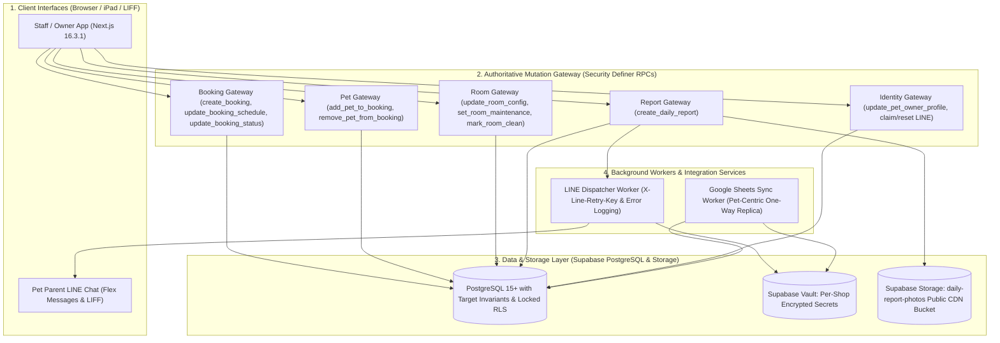

# 🏛️ PawSpace — System Architecture & Target Implementation Specification

> **Document Status:** Authoritative Target Specification (Final Hardened Specification)
> **Target Release:** V1 Lean MVP
> **Technical Stack:** Next.js 16.3.1 (App Router) + React 19 + TypeScript + Tailwind CSS + Supabase (PostgreSQL 15+)
> **Architecture Principle:** **No generic CRUD on invariant-bearing tables from browser clients. All system mutations MUST go through authoritative Security Definer RPCs.**

---

## 1. ผังการทำงานของระบบ V1 (Target Architecture Diagram)



---

## 2. ตาราง Mutation Surface & Authoritative Gateway (Target Contract)

หลัก V1: **Browser Client มีสิทธิ์อ่านผ่าน RLS แต่ไม่มี Generic INSERT/UPDATE/DELETE บนตารางธุรกิจหลัก** ทุก mutation ต้องผ่าน RPC หรือ Server Service ที่กำหนด tenant, role และ invariant เอง

| Entity | Direct Client INSERT | UPDATE | DELETE | Authoritative Gateway |
| :--- | :---: | :---: | :---: | :--- |
| `shops` | ❌ | ❌ | ❌ | `update_shop_profile()`, Google Sheet proof-of-control flow, `disconnect_google_sheet()` |
| `staff_users` | ❌ | ❌ | ❌ | Owner-only Staff Management Server Service |
| `pet_owners` | ❌ | ❌ | ❌ | `create_pet_owner()`, `update_pet_owner_profile()`, `delete_pet_owner()`, LINE claim/reset flow |
| `pets` | ❌ | ❌ | ❌ | `create_pet()`, `update_pet_profile()`, `transfer_pet_owner()`, `delete_pet()` |
| `rooms` | ❌ | ❌ | ❌ | `create_room()`, `update_room_config()`, `set_room_maintenance()`, `mark_room_clean()` |
| `bookings` | ❌ | ❌ | ❌ | `create_booking()`, `update_booking_schedule()`, `update_booking_status()` |
| `booking_pets` | ❌ | ❌ | ❌ | `add_pet_to_booking()`, `remove_pet_from_booking()` |
| `daily_reports` | ❌ | ❌ | ❌ | `create_daily_report()`, `retry_daily_report_delivery()`; delivery fields worker-owned |
| `google_sync_mappings` | ❌ | ❌ | ❌ | Google Sync Worker / internal sync helpers |
| `sync_queue` | ❌ | ❌ | ❌ | Internal outbox enqueue + Google Sync Worker |

> `service_role` ใช้ได้เฉพาะ trusted server/worker เท่านั้นและห้ามส่ง key ไป Browser. การที่ service role bypass RLS ไม่ถือเป็น client mutation path.
## 3. สัญญาการจัดลำดับการล็อกเพื่อป้องกัน Deadlock (Deterministic Global Lock Ordering Contract)

สำหรับ RPC ที่แตะ Booking aggregate มากกว่าหนึ่ง entity ให้ใช้ลำดับเดียวกันเสมอ:

1. **Booking** — `FOR UPDATE`
2. **Pets** — lock ทุก Pet ที่เกี่ยวข้องแบบ `ORDER BY id FOR UPDATE`
3. **Room** — `FOR UPDATE`

ข้อยกเว้นที่ชัดเจน:
- `create_booking()` ยังไม่มี Booking row จึง lock Room ก่อน insert; room exclusion constraint เป็น final guard
- Room-only configuration/maintenance RPC lock Room row เท่านั้น และทุก booking mutation ที่จะเข้าห้องนั้นต้อง revalidate หลังได้ Room lock
- `create_daily_report()` ใช้ Booking → Pet และไม่ต้อง lock Room
- Customer/Pet/Shop profile RPC ที่ไม่แตะ Booking aggregate lock เฉพาะ row เป้าหมาย

ห้ามมี RPC ใด lock Room ก่อนแล้วค่อยขอ Booking/Pet lock ใน transaction เดียวกัน
## 4. โครงสร้างฐานข้อมูลเป้าหมาย (Target PostgreSQL Schema Specification)

```sql
-- 0. Extensions
CREATE EXTENSION IF NOT EXISTS btree_gist;
CREATE EXTENSION IF NOT EXISTS "uuid-ossp";
CREATE EXTENSION IF NOT EXISTS pgcrypto;

-- 1. Shops / Tenants
CREATE TABLE shops (
    id UUID PRIMARY KEY DEFAULT gen_random_uuid(),
    name VARCHAR(255) NOT NULL,
    slug VARCHAR(100) UNIQUE NOT NULL,
    phone VARCHAR(50),
    line_oa_id VARCHAR(100),
    google_sheet_id VARCHAR(255) UNIQUE, -- System-bound only after proof-of-control
    google_sheet_claim_token_hash VARCHAR(64), -- System-controlled temporary binding proof
    google_sheet_claim_expires_at TIMESTAMPTZ,
    subscription_status VARCHAR(50) NOT NULL DEFAULT 'trial' CHECK (subscription_status IN ('trial', 'active', 'past_due')),
    created_at TIMESTAMPTZ DEFAULT now(),
    UNIQUE (id),
    UNIQUE (google_sheet_claim_token_hash)
);

-- 2. Staff Users (ผูก 1:1 กับ auth.users ของ Supabase)
CREATE TABLE staff_users (
    id UUID PRIMARY KEY REFERENCES auth.users(id) ON DELETE CASCADE,
    shop_id UUID NOT NULL REFERENCES shops(id) ON DELETE CASCADE,
    email VARCHAR(255) NOT NULL,
    name VARCHAR(255) NOT NULL,
    role VARCHAR(50) NOT NULL DEFAULT 'staff' CHECK (role IN ('owner', 'manager', 'staff')),
    is_active BOOLEAN NOT NULL DEFAULT TRUE,
    disabled_at TIMESTAMPTZ,
    created_at TIMESTAMPTZ DEFAULT now(),
    UNIQUE (shop_id, id)
);

-- 3. Pet Owners (Customers) & Verified LINE Claim Fields
CREATE TABLE pet_owners (
    id UUID PRIMARY KEY DEFAULT gen_random_uuid(),
    shop_id UUID NOT NULL REFERENCES shops(id) ON DELETE CASCADE,
    line_user_id VARCHAR(100), -- System-controlled
    line_claim_token_hash VARCHAR(64), -- System-controlled
    line_claim_expires_at TIMESTAMPTZ, -- System-controlled
    line_claim_used_at TIMESTAMPTZ, -- System-controlled
    first_name VARCHAR(100) NOT NULL,
    last_name VARCHAR(100),
    phone VARCHAR(50) NOT NULL,
    emergency_phone VARCHAR(50),
    address TEXT,
    created_at TIMESTAMPTZ DEFAULT now(),
    UNIQUE (shop_id, id),
    UNIQUE (shop_id, phone),
    UNIQUE (shop_id, line_user_id),
    UNIQUE (line_claim_token_hash)
);

-- 4. Pets (With Mutation Lock on owner_id)
CREATE TABLE pets (
    id UUID PRIMARY KEY DEFAULT gen_random_uuid(),
    shop_id UUID NOT NULL REFERENCES shops(id) ON DELETE CASCADE,
    owner_id UUID NOT NULL,
    name VARCHAR(100) NOT NULL,
    species VARCHAR(50) NOT NULL CHECK (species IN ('dog', 'cat')),
    breed VARCHAR(100),
    gender VARCHAR(20) CHECK (gender IN ('male', 'female', 'neutered_male', 'spayed_female')),
    birth_date DATE,
    weight_kg NUMERIC(5,2),
    avatar_url TEXT,
    special_care_notes TEXT,
    allergies TEXT,
    created_at TIMESTAMPTZ DEFAULT now(),
    UNIQUE (shop_id, id),
    FOREIGN KEY (shop_id, owner_id) REFERENCES pet_owners(shop_id, id) ON DELETE CASCADE
);

-- 5. Rooms & Spaces (System-Controlled status & Maintenance Window)
CREATE TABLE rooms (
    id UUID PRIMARY KEY DEFAULT gen_random_uuid(),
    shop_id UUID NOT NULL REFERENCES shops(id) ON DELETE CASCADE,
    room_number VARCHAR(50) NOT NULL,
    room_type VARCHAR(50) NOT NULL CHECK (room_type IN ('standard', 'deluxe', 'vip', 'cat_condo')),
    capacity_pets INT NOT NULL DEFAULT 1 CHECK (capacity_pets >= 1),
    base_price_per_night NUMERIC(10,2) NOT NULL CHECK (base_price_per_night >= 0),
    status VARCHAR(50) NOT NULL DEFAULT 'available' CHECK (status IN ('available', 'occupied', 'cleaning', 'maintenance')),
    maintenance_from DATE,
    maintenance_until DATE,
    created_at TIMESTAMPTZ DEFAULT now(),
    UNIQUE (shop_id, id),
    UNIQUE (shop_id, room_number),
    CONSTRAINT check_maintenance_dates CHECK (
        (maintenance_from IS NULL AND maintenance_until IS NULL) OR
        (maintenance_from IS NOT NULL AND maintenance_until IS NOT NULL AND maintenance_until >= maintenance_from)
    )
);

-- 6. Bookings (Direct INSERT/UPDATE/DELETE Denied; Managed exclusively via RPCs)
CREATE TABLE bookings (
    id UUID PRIMARY KEY DEFAULT gen_random_uuid(),
    shop_id UUID NOT NULL REFERENCES shops(id) ON DELETE CASCADE,
    owner_id UUID NOT NULL,
    room_id UUID NOT NULL,
    check_in_date DATE NOT NULL,
    check_out_date DATE NOT NULL,
    booking_status VARCHAR(50) NOT NULL DEFAULT 'confirmed' CHECK (booking_status IN ('confirmed', 'checked_in', 'checked_out', 'cancelled')),
    total_amount NUMERIC(10,2) NOT NULL DEFAULT 0 CHECK (total_amount >= 0),
    special_requests TEXT,
    created_at TIMESTAMPTZ DEFAULT now(),
    UNIQUE (shop_id, id),

    FOREIGN KEY (shop_id, owner_id) REFERENCES pet_owners(shop_id, id) ON DELETE RESTRICT,
    FOREIGN KEY (shop_id, room_id) REFERENCES rooms(shop_id, id) ON DELETE RESTRICT,

    CONSTRAINT check_dates_valid CHECK (check_out_date > check_in_date),

    CONSTRAINT prevent_double_booking EXCLUDE USING gist (
        room_id WITH =,
        daterange(check_in_date, check_out_date, '[)') WITH &&
    ) WHERE (booking_status IN ('confirmed', 'checked_in'))
);

-- 7. Booking Pets (Junction Table: Composite Unique Constraint for Membership Integrity)
CREATE TABLE booking_pets (
    id UUID PRIMARY KEY DEFAULT gen_random_uuid(),
    shop_id UUID NOT NULL,
    booking_id UUID NOT NULL,
    pet_id UUID NOT NULL,
    created_at TIMESTAMPTZ DEFAULT now(),
    UNIQUE (booking_id, pet_id),
    UNIQUE (shop_id, booking_id, pet_id), -- Composite Unique Constraint for Daily Reports FK
    FOREIGN KEY (shop_id, booking_id) REFERENCES bookings(shop_id, id) ON DELETE CASCADE,
    FOREIGN KEY (shop_id, pet_id) REFERENCES pets(shop_id, id) ON DELETE RESTRICT
);

-- 8. Daily Care Reports (Relational Membership FK & Dual Idempotency)
CREATE TABLE daily_reports (
    id UUID PRIMARY KEY DEFAULT gen_random_uuid(),
    shop_id UUID NOT NULL REFERENCES shops(id) ON DELETE CASCADE,
    booking_id UUID NOT NULL,
    pet_id UUID NOT NULL,
    report_date DATE NOT NULL DEFAULT ((now() AT TIME ZONE 'Asia/Bangkok')::date),
    idempotency_key UUID NOT NULL, -- Client deduplication key; unique per tenant
    request_fingerprint TEXT NOT NULL, -- SHA-256 of canonical request payload; prevents key reuse with different input
    line_delivery_retry_key UUID NOT NULL UNIQUE, -- X-Line-Retry-Key persistent token
    food_status VARCHAR(50) NOT NULL CHECK (food_status IN ('finished', 'half', 'little', 'refused')),
    excretion_status VARCHAR(50) NOT NULL CHECK (excretion_status IN ('normal', 'diarrhea', 'none')),
    mood_status VARCHAR(50) NOT NULL CHECK (mood_status IN ('happy', 'calm', 'stressed')),
    photo_urls TEXT[] NOT NULL DEFAULT '{}',
    staff_notes TEXT,
    line_delivery_status VARCHAR(50) NOT NULL DEFAULT 'pending' CHECK (line_delivery_status IN ('pending', 'sending', 'sent', 'failed')),
    line_delivery_started_at TIMESTAMPTZ, -- worker lease/recovery timestamp
    line_sent_at TIMESTAMPTZ,
    line_error_message TEXT,
    line_retry_count INT NOT NULL DEFAULT 0 CHECK (line_retry_count >= 0),
    created_at TIMESTAMPTZ DEFAULT now(),

    -- Composite Relational Membership Integrity: Enforces pet is ACTUALLY in this booking
    FOREIGN KEY (shop_id, booking_id, pet_id) REFERENCES booking_pets(shop_id, booking_id, pet_id) ON DELETE CASCADE,

    UNIQUE (shop_id, idempotency_key),
    CONSTRAINT check_photo_count CHECK (cardinality(photo_urls) BETWEEN 1 AND 4)
);

-- 9. Sync Outbox & Mapping (Google Sheets Sync: Worker-Owned)
CREATE TABLE google_sync_mappings (
    id UUID PRIMARY KEY DEFAULT gen_random_uuid(),
    shop_id UUID NOT NULL REFERENCES shops(id) ON DELETE CASCADE,
    entity_type VARCHAR(50) NOT NULL CHECK (entity_type IN ('pet_customer','booking')), -- canonical sync entity
    entity_id UUID NOT NULL,
    sheet_name VARCHAR(100) NOT NULL,
    synced_hash TEXT,
    last_synced_at TIMESTAMPTZ DEFAULT now(),
    UNIQUE (shop_id, entity_type, entity_id)
);

CREATE TABLE sync_queue (
    id UUID PRIMARY KEY DEFAULT gen_random_uuid(),
    shop_id UUID NOT NULL REFERENCES shops(id) ON DELETE CASCADE,
    entity_type VARCHAR(50) NOT NULL CHECK (entity_type IN ('pet_customer','booking')),
    entity_id UUID NOT NULL,
    operation VARCHAR(20) NOT NULL CHECK (operation IN ('UPSERT', 'DELETE')),
    payload JSONB NOT NULL,
    attempts INT NOT NULL DEFAULT 0 CHECK (attempts >= 0),
    status VARCHAR(50) NOT NULL DEFAULT 'pending' CHECK (status IN ('pending', 'processing', 'failed', 'completed')),
    processing_started_at TIMESTAMPTZ,
    last_attempt_at TIMESTAMPTZ,
    next_attempt_at TIMESTAMPTZ NOT NULL DEFAULT now(),
    last_error TEXT,
    created_at TIMESTAMPTZ DEFAULT now()
);
```

---

## 5. Security Definer Helper Functions

> **V1 Business Time:** วันที่ธุรกิจทั้งหมดใช้ `Asia/Bangkok` ไม่ใช้ PostgreSQL session `CURRENT_DATE` ตรง ๆ เพื่อไม่ให้ช่วง 00:00–06:59 เวลาไทยคลาดหนึ่งวันจาก UTC.

```sql
CREATE OR REPLACE FUNCTION pawspace_business_date()
RETURNS DATE AS $$
    SELECT (now() AT TIME ZONE 'Asia/Bangkok')::date;
$$ LANGUAGE sql STABLE SET search_path = public, pg_temp;
REVOKE ALL ON FUNCTION pawspace_business_date() FROM PUBLIC;
GRANT EXECUTE ON FUNCTION pawspace_business_date() TO authenticated, service_role;

CREATE OR REPLACE FUNCTION current_staff_shop_id()
RETURNS UUID AS $$
    SELECT shop_id
    FROM staff_users
    WHERE id = auth.uid() AND is_active = TRUE;
$$ LANGUAGE sql STABLE SECURITY DEFINER SET search_path = public, pg_temp;
REVOKE ALL ON FUNCTION current_staff_shop_id() FROM PUBLIC;
GRANT EXECUTE ON FUNCTION current_staff_shop_id() TO authenticated, service_role;

CREATE OR REPLACE FUNCTION is_shop_owner()
RETURNS BOOLEAN AS $$
    SELECT EXISTS (
        SELECT 1 FROM staff_users
        WHERE id = auth.uid() AND is_active = TRUE AND role = 'owner'
    );
$$ LANGUAGE sql STABLE SECURITY DEFINER SET search_path = public, pg_temp;
REVOKE ALL ON FUNCTION is_shop_owner() FROM PUBLIC;
GRANT EXECUTE ON FUNCTION is_shop_owner() TO authenticated, service_role;

CREATE OR REPLACE FUNCTION is_shop_manager_or_owner()
RETURNS BOOLEAN AS $$
    SELECT EXISTS (
        SELECT 1 FROM staff_users
        WHERE id = auth.uid() AND is_active = TRUE AND role IN ('owner', 'manager')
    );
$$ LANGUAGE sql STABLE SECURITY DEFINER SET search_path = public, pg_temp;
REVOKE ALL ON FUNCTION is_shop_manager_or_owner() FROM PUBLIC;
GRANT EXECUTE ON FUNCTION is_shop_manager_or_owner() TO authenticated, service_role;

-- Internal transactional outbox helper. Never callable from Browser.
CREATE OR REPLACE FUNCTION enqueue_sync_event(
    p_shop_id UUID,
    p_entity_type VARCHAR,
    p_entity_id UUID,
    p_operation VARCHAR,
    p_payload JSONB
)
RETURNS VOID AS $$
BEGIN
    INSERT INTO sync_queue (shop_id, entity_type, entity_id, operation, payload)
    VALUES (p_shop_id, p_entity_type, p_entity_id, p_operation, p_payload);
END;
$$ LANGUAGE plpgsql SECURITY DEFINER SET search_path = public, pg_temp;
REVOKE ALL ON FUNCTION enqueue_sync_event(UUID, VARCHAR, UUID, VARCHAR, JSONB) FROM PUBLIC, anon, authenticated;
GRANT EXECUTE ON FUNCTION enqueue_sync_event(UUID, VARCHAR, UUID, VARCHAR, JSONB) TO service_role;
```

> Mutation RPCs ที่ต้อง export ไป Google Sheets ต้อง enqueue outbox **ใน transaction เดียวกับ business mutation**. การ implement migration สามารถเรียก internal helper ด้วย function-owner privileges โดยไม่ grant helper ให้ Browser.

---
## 6. Authoritative Mutation Gateway RPCs (Core Engine)

### 1. Booking Creation RPC: `create_booking`
```sql
CREATE OR REPLACE FUNCTION create_booking(
    p_owner_id UUID,
    p_room_id UUID,
    p_check_in_date DATE,
    p_check_out_date DATE,
    p_total_amount NUMERIC(10,2) DEFAULT 0,
    p_special_requests TEXT DEFAULT NULL
)
RETURNS UUID AS $$
DECLARE
    v_shop_id UUID;
    v_m_from DATE;
    v_m_until DATE;
    v_room_status VARCHAR;
    v_booking_id UUID;
BEGIN
    v_shop_id := current_staff_shop_id();
    IF v_shop_id IS NULL THEN
        RAISE EXCEPTION 'Unauthorized: Caller is not an authenticated staff member.';
    END IF;

    IF p_check_out_date <= p_check_in_date THEN
        RAISE EXCEPTION 'Invalid Dates: check_out_date must be strictly after check_in_date.';
    END IF;

    IF p_total_amount < 0 THEN
        RAISE EXCEPTION 'Invalid Amount: total_amount must be >= 0.';
    END IF;

    -- Validate Owner belongs to shop
    IF NOT EXISTS (SELECT 1 FROM pet_owners WHERE id = p_owner_id AND shop_id = v_shop_id) THEN
        RAISE EXCEPTION 'Pet owner % not found for shop %.', p_owner_id, v_shop_id;
    END IF;

    -- Lock & Validate Room (Lock ordering: Room locked on creation)
    SELECT status, maintenance_from, maintenance_until
    INTO v_room_status, v_m_from, v_m_until
    FROM rooms
    WHERE id = p_room_id AND shop_id = v_shop_id
    FOR UPDATE;

    IF NOT FOUND THEN
        RAISE EXCEPTION 'Room % not found for shop %.', p_room_id, v_shop_id;
    END IF;

    -- Validate Maintenance Window
    IF v_m_from IS NOT NULL AND v_m_until IS NOT NULL THEN
        IF daterange(p_check_in_date, p_check_out_date, '[)') && daterange(v_m_from, v_m_until, '[]') THEN
            RAISE EXCEPTION 'Room Maintenance Violation: Room % is under maintenance from % to %.',
                p_room_id, v_m_from, v_m_until;
        END IF;
    END IF;

    -- Insert Booking (GiST constraint handles collision)
    INSERT INTO bookings (
        shop_id, owner_id, room_id, check_in_date, check_out_date,
        booking_status, total_amount, special_requests
    )
    VALUES (
        v_shop_id, p_owner_id, p_room_id, p_check_in_date, p_check_out_date,
        'confirmed', p_total_amount, p_special_requests
    )
    RETURNING id INTO v_booking_id;
    PERFORM enqueue_sync_event(v_shop_id,'booking',v_booking_id,'UPSERT',jsonb_build_object('booking_id',v_booking_id));

    RETURN v_booking_id;
END;
$$ LANGUAGE plpgsql SECURITY DEFINER SET search_path = public, pg_temp;

REVOKE ALL ON FUNCTION create_booking(UUID, UUID, DATE, DATE, NUMERIC, TEXT) FROM PUBLIC;
GRANT EXECUTE ON FUNCTION create_booking(UUID, UUID, DATE, DATE, NUMERIC, TEXT) TO authenticated, service_role;
```

### 2. Pet Assignment RPC: `add_pet_to_booking`
```sql
CREATE OR REPLACE FUNCTION add_pet_to_booking(
    p_booking_id UUID,
    p_pet_id UUID
)
RETURNS VOID AS $$
DECLARE
    v_shop_id UUID;
    v_booking_owner_id UUID;
    v_booking_status VARCHAR;
    v_room_id UUID;
    v_check_in DATE;
    v_check_out DATE;
    v_pet_owner_id UUID;
    v_m_from DATE;
    v_m_until DATE;
    v_capacity INT;
    v_current_count INT;
BEGIN
    v_shop_id := current_staff_shop_id();
    IF v_shop_id IS NULL THEN
        RAISE EXCEPTION 'Unauthorized';
    END IF;

    -- DETERMINISTIC LOCK ORDERING: 1. Booking ➔ 2. Pet ➔ 3. Room
    -- 1. Lock Booking
    SELECT owner_id, booking_status, room_id, check_in_date, check_out_date
    INTO v_booking_owner_id, v_booking_status, v_room_id, v_check_in, v_check_out
    FROM bookings
    WHERE id = p_booking_id AND shop_id = v_shop_id
    FOR UPDATE;

    IF NOT FOUND THEN
        RAISE EXCEPTION 'Booking % not found.', p_booking_id;
    END IF;

    IF v_booking_status NOT IN ('confirmed', 'checked_in') THEN
        RAISE EXCEPTION 'Cannot add pet to booking in state %.', v_booking_status;
    END IF;

    -- 2. Lock Pet
    SELECT owner_id INTO v_pet_owner_id
    FROM pets
    WHERE id = p_pet_id AND shop_id = v_shop_id
    FOR UPDATE;

    IF NOT FOUND THEN
        RAISE EXCEPTION 'Pet % not found.', p_pet_id;
    END IF;

    -- 3. Lock Room
    SELECT capacity_pets, maintenance_from, maintenance_until
    INTO v_capacity, v_m_from, v_m_until
    FROM rooms
    WHERE id = v_room_id AND shop_id = v_shop_id
    FOR UPDATE;

    -- Strict Same-Owner Invariant (Decision 1A)
    IF v_pet_owner_id != v_booking_owner_id THEN
        RAISE EXCEPTION 'Ownership Violation: Pet % belongs to owner %, not booking owner %.',
            p_pet_id, v_pet_owner_id, v_booking_owner_id;
    END IF;

    -- Concurrency-Safe Pet No-Overlap Check (Decision 2A)
    IF EXISTS (
        SELECT 1
        FROM booking_pets bp
        JOIN bookings b ON b.id = bp.booking_id
        WHERE bp.pet_id = p_pet_id
          AND b.shop_id = v_shop_id
          AND b.id != p_booking_id
          AND b.booking_status IN ('confirmed', 'checked_in')
          AND daterange(b.check_in_date, b.check_out_date, '[)') && daterange(v_check_in, v_check_out, '[)')
    ) THEN
        RAISE EXCEPTION 'Pet Conflict: Pet % already has an active booking overlapping % to %.',
            p_pet_id, v_check_in, v_check_out;
    END IF;

    -- Capacity Check
    SELECT COUNT(*) INTO v_current_count
    FROM booking_pets
    WHERE booking_id = p_booking_id AND shop_id = v_shop_id;

    IF v_current_count >= v_capacity THEN
        RAISE EXCEPTION 'Capacity Exceeded: Room capacity of % reached for Booking %.',
            v_capacity, p_booking_id;
    END IF;

    INSERT INTO booking_pets (shop_id, booking_id, pet_id)
    VALUES (v_shop_id, p_booking_id, p_pet_id);
    PERFORM enqueue_sync_event(v_shop_id,'booking',p_booking_id,'UPSERT',jsonb_build_object('booking_id',p_booking_id));
END;
$$ LANGUAGE plpgsql SECURITY DEFINER SET search_path = public, pg_temp;

REVOKE ALL ON FUNCTION add_pet_to_booking(UUID, UUID) FROM PUBLIC;
GRANT EXECUTE ON FUNCTION add_pet_to_booking(UUID, UUID) TO authenticated, service_role;
```

### 3. Pet Removal RPC: `remove_pet_from_booking`
```sql
CREATE OR REPLACE FUNCTION remove_pet_from_booking(
    p_booking_id UUID,
    p_pet_id UUID
)
RETURNS VOID AS $$
DECLARE
    v_shop_id UUID;
    v_status VARCHAR;
BEGIN
    v_shop_id := current_staff_shop_id();
    IF v_shop_id IS NULL THEN
        RAISE EXCEPTION 'Unauthorized';
    END IF;

    -- DETERMINISTIC LOCK ORDERING: 1. Booking ➔ 2. Pet
    SELECT booking_status INTO v_status
    FROM bookings
    WHERE id = p_booking_id AND shop_id = v_shop_id
    FOR UPDATE;

    IF NOT FOUND THEN
        RAISE EXCEPTION 'Booking % not found.', p_booking_id;
    END IF;

    IF v_status != 'confirmed' THEN
        RAISE EXCEPTION 'Cannot remove pet: Booking is currently % (only confirmed bookings allow pet removal).', v_status;
    END IF;

    PERFORM 1 FROM pets WHERE id = p_pet_id AND shop_id = v_shop_id FOR UPDATE;

    DELETE FROM booking_pets
    WHERE booking_id = p_booking_id AND pet_id = p_pet_id AND shop_id = v_shop_id;
    PERFORM enqueue_sync_event(v_shop_id,'booking',p_booking_id,'UPSERT',jsonb_build_object('booking_id',p_booking_id));
END;
$$ LANGUAGE plpgsql SECURITY DEFINER SET search_path = public, pg_temp;

REVOKE ALL ON FUNCTION remove_pet_from_booking(UUID, UUID) FROM PUBLIC;
GRANT EXECUTE ON FUNCTION remove_pet_from_booking(UUID, UUID) TO authenticated, service_role;
```

### 4. Status Transition RPC: `update_booking_status` (Decision A1 & 3A)
```sql
CREATE OR REPLACE FUNCTION update_booking_status(
    p_booking_id UUID,
    p_new_status VARCHAR
)
RETURNS VOID AS $$
DECLARE
    v_shop_id UUID;
    v_current_status VARCHAR;
    v_room_id UUID;
    v_check_in DATE;
    v_room_status VARCHAR;
    v_m_from DATE;
    v_m_until DATE;
    v_pet_count INT;
BEGIN
    v_shop_id := current_staff_shop_id();
    IF v_shop_id IS NULL THEN
        RAISE EXCEPTION 'Unauthorized';
    END IF;

    -- 1. Lock Booking
    SELECT booking_status, room_id, check_in_date
    INTO v_current_status, v_room_id, v_check_in
    FROM bookings
    WHERE id = p_booking_id AND shop_id = v_shop_id
    FOR UPDATE;

    IF NOT FOUND THEN
        RAISE EXCEPTION 'Booking % not found.', p_booking_id;
    END IF;

    -- 2. Lock Assigned Pets (Sorted)
    PERFORM 1 FROM pets p
    JOIN booking_pets bp ON bp.pet_id = p.id
    WHERE bp.booking_id = p_booking_id
    ORDER BY p.id
    FOR UPDATE;

    -- 3. Lock Room
    SELECT status, maintenance_from, maintenance_until
    INTO v_room_status, v_m_from, v_m_until
    FROM rooms
    WHERE id = v_room_id AND shop_id = v_shop_id
    FOR UPDATE;

    -- Transition: Confirmed ➔ Checked-In
    IF v_current_status = 'confirmed' AND p_new_status = 'checked_in' THEN
        -- Self-heal stale stored maintenance status after a maintenance window has ended.
        -- Booking safety still relies on the date window below, not only on rooms.status.
        IF v_room_status = 'maintenance' AND NOT (
            v_m_from IS NOT NULL AND v_m_until IS NOT NULL
            AND pawspace_business_date() BETWEEN v_m_from AND v_m_until
        ) THEN
            UPDATE rooms SET status = 'available' WHERE id = v_room_id AND shop_id = v_shop_id;
            v_room_status := 'available';
        END IF;

        -- Decision A1: Strictly check_in_date
        IF pawspace_business_date() != v_check_in THEN
            RAISE EXCEPTION 'Early/Late Check-in Violation: Booking % can only be checked in on % (Current: %). Use update_booking_schedule() first.',
                p_booking_id, v_check_in, pawspace_business_date();
        END IF;

        -- Operational Room State Validation
        IF v_room_status != 'available' THEN
            RAISE EXCEPTION 'Room State Conflict: Room % is currently % (must be available for check-in).',
                v_room_id, v_room_status;
        END IF;

        -- Maintenance Check
        IF v_m_from IS NOT NULL AND v_m_until IS NOT NULL AND pawspace_business_date() BETWEEN v_m_from AND v_m_until THEN
            RAISE EXCEPTION 'Room Maintenance Conflict: Room % is currently under maintenance.', v_room_id;
        END IF;

        -- Require >= 1 Pet
        SELECT COUNT(*) INTO v_pet_count
        FROM booking_pets
        WHERE booking_id = p_booking_id AND shop_id = v_shop_id;

        IF v_pet_count < 1 THEN
            RAISE EXCEPTION 'Cannot check-in booking %: No pets assigned (minimum 1 pet required).', p_booking_id;
        END IF;

        UPDATE bookings SET booking_status = 'checked_in' WHERE id = p_booking_id;
        UPDATE rooms SET status = 'occupied' WHERE id = v_room_id;

    -- Transition: Checked-In ➔ Checked-Out
    ELSIF v_current_status = 'checked_in' AND p_new_status = 'checked_out' THEN
        UPDATE bookings SET booking_status = 'checked_out' WHERE id = p_booking_id;
        UPDATE rooms SET status = 'cleaning' WHERE id = v_room_id;

    -- Transition: Confirmed ➔ Cancelled
    ELSIF v_current_status = 'confirmed' AND p_new_status = 'cancelled' THEN
        UPDATE bookings SET booking_status = 'cancelled' WHERE id = p_booking_id;

    ELSE
        RAISE EXCEPTION 'Illegal Status Transition: Cannot transition booking % from % to %.',
            p_booking_id, v_current_status, p_new_status;
    END IF;
    PERFORM enqueue_sync_event(v_shop_id,'booking',p_booking_id,'UPSERT',jsonb_build_object('booking_id',p_booking_id));
END;
$$ LANGUAGE plpgsql SECURITY DEFINER SET search_path = public, pg_temp;

REVOKE ALL ON FUNCTION update_booking_status(UUID, VARCHAR) FROM PUBLIC;
GRANT EXECUTE ON FUNCTION update_booking_status(UUID, VARCHAR) TO authenticated, service_role;
```

### 5. Schedule Mutation RPC: `update_booking_schedule` (Confirmed Only)
```sql
CREATE OR REPLACE FUNCTION update_booking_schedule(
    p_booking_id UUID,
    p_new_room_id UUID,
    p_new_check_in DATE,
    p_new_check_out DATE,
    p_special_requests TEXT DEFAULT NULL,
    p_total_amount NUMERIC(10,2) DEFAULT NULL
)
RETURNS VOID AS $$
DECLARE
    v_shop_id UUID;
    v_status VARCHAR;
    v_m_from DATE;
    v_m_until DATE;
    v_capacity INT;
    v_pet_count INT;
BEGIN
    v_shop_id := current_staff_shop_id();
    IF v_shop_id IS NULL THEN
        RAISE EXCEPTION 'Unauthorized';
    END IF;

    IF p_new_check_out <= p_new_check_in THEN
        RAISE EXCEPTION 'Invalid Dates: check_out_date must be strictly after check_in_date.';
    END IF;

    -- 1. Lock Booking
    SELECT booking_status INTO v_status
    FROM bookings
    WHERE id = p_booking_id AND shop_id = v_shop_id
    FOR UPDATE;

    IF NOT FOUND THEN
        RAISE EXCEPTION 'Booking % not found.', p_booking_id;
    END IF;

    -- Enforce Confirmed Only
    IF v_status != 'confirmed' THEN
        RAISE EXCEPTION 'Cannot update schedule for booking in state % (only confirmed bookings can be rescheduled).', v_status;
    END IF;

    -- 2. Lock Assigned Pets (Sorted)
    PERFORM 1 FROM pets p
    JOIN booking_pets bp ON bp.pet_id = p.id
    WHERE bp.booking_id = p_booking_id
    ORDER BY p.id
    FOR UPDATE;

    -- 3. Lock Room
    SELECT capacity_pets, maintenance_from, maintenance_until
    INTO v_capacity, v_m_from, v_m_until
    FROM rooms
    WHERE id = p_new_room_id AND shop_id = v_shop_id
    FOR UPDATE;

    IF NOT FOUND THEN
        RAISE EXCEPTION 'Room % not found.', p_new_room_id;
    END IF;

    -- Maintenance Window Check
    IF v_m_from IS NOT NULL AND v_m_until IS NOT NULL THEN
        IF daterange(p_new_check_in, p_new_check_out, '[)') && daterange(v_m_from, v_m_until, '[]') THEN
            RAISE EXCEPTION 'Room Maintenance Violation: Room % is under maintenance from % to %.',
                p_new_room_id, v_m_from, v_m_until;
        END IF;
    END IF;

    -- Capacity Check
    SELECT COUNT(*) INTO v_pet_count
    FROM booking_pets
    WHERE booking_id = p_booking_id AND shop_id = v_shop_id;

    IF v_pet_count > v_capacity THEN
        RAISE EXCEPTION 'Room Capacity Violation: Room % capacity (%) cannot accommodate % assigned pets.',
            p_new_room_id, v_capacity, v_pet_count;
    END IF;

    -- Pet No-Overlap Revalidation
    IF EXISTS (
        SELECT 1
        FROM booking_pets bp_this
        JOIN booking_pets bp_other ON bp_other.pet_id = bp_this.pet_id
        JOIN bookings b_other ON b_other.id = bp_other.booking_id
        WHERE bp_this.booking_id = p_booking_id
          AND b_other.id != p_booking_id
          AND b_other.shop_id = v_shop_id
          AND b_other.booking_status IN ('confirmed', 'checked_in')
          AND daterange(b_other.check_in_date, b_other.check_out_date, '[)') && daterange(p_new_check_in, p_new_check_out, '[)')
    ) THEN
        RAISE EXCEPTION 'Pet Conflict: One or more pets have overlapping active bookings for the new date range.';
    END IF;

    UPDATE bookings
    SET room_id = p_new_room_id,
        check_in_date = p_new_check_in,
        check_out_date = p_new_check_out,
        special_requests = COALESCE(p_special_requests, special_requests),
        total_amount = COALESCE(p_total_amount, total_amount)
    WHERE id = p_booking_id AND shop_id = v_shop_id;
    PERFORM enqueue_sync_event(v_shop_id,'booking',p_booking_id,'UPSERT',jsonb_build_object('booking_id',p_booking_id));
END;
$$ LANGUAGE plpgsql SECURITY DEFINER SET search_path = public, pg_temp;

REVOKE ALL ON FUNCTION update_booking_schedule(UUID, UUID, DATE, DATE, TEXT, NUMERIC) FROM PUBLIC;
GRANT EXECUTE ON FUNCTION update_booking_schedule(UUID, UUID, DATE, DATE, TEXT, NUMERIC) TO authenticated, service_role;
```

### 6. Daily Report Authoritative Creation RPC: `create_daily_report`
```sql
CREATE OR REPLACE FUNCTION create_daily_report(
    p_booking_id UUID,
    p_pet_id UUID,
    p_food_status VARCHAR,
    p_excretion_status VARCHAR,
    p_mood_status VARCHAR,
    p_photo_urls TEXT[],
    p_staff_notes TEXT,
    p_idempotency_key UUID
)
RETURNS UUID AS $$
DECLARE
    v_shop_id UUID;
    v_booking_status VARCHAR;
    v_report_id UUID;
    v_line_retry_key UUID;
    v_request_fingerprint TEXT;
    v_existing_fingerprint TEXT;
BEGIN
    v_shop_id := current_staff_shop_id();
    IF v_shop_id IS NULL THEN RAISE EXCEPTION 'Unauthorized'; END IF;

    v_request_fingerprint := encode(digest(jsonb_build_object(
        'booking_id', p_booking_id, 'pet_id', p_pet_id,
        'food_status', p_food_status, 'excretion_status', p_excretion_status,
        'mood_status', p_mood_status, 'photo_urls', to_jsonb(p_photo_urls),
        'staff_notes', p_staff_notes
    )::text, 'sha256'), 'hex');

    -- Fast idempotent replay, including retries that arrive after checkout.
    SELECT id, request_fingerprint INTO v_report_id, v_existing_fingerprint
    FROM daily_reports
    WHERE shop_id = v_shop_id AND idempotency_key = p_idempotency_key;
    IF FOUND THEN
        IF v_existing_fingerprint != v_request_fingerprint THEN
            RAISE EXCEPTION 'Idempotency Key Reuse Conflict: same key used with different request payload.';
        END IF;
        RETURN v_report_id;
    END IF;

    -- Serialize against check-out before validating checked_in state.
    SELECT booking_status INTO v_booking_status
    FROM bookings
    WHERE id = p_booking_id AND shop_id = v_shop_id
    FOR UPDATE;
    IF NOT FOUND THEN RAISE EXCEPTION 'Booking % not found.', p_booking_id; END IF;

    -- Re-check after waiting for the Booking lock so concurrent duplicate requests converge.
    SELECT id, request_fingerprint INTO v_report_id, v_existing_fingerprint
    FROM daily_reports
    WHERE shop_id = v_shop_id AND idempotency_key = p_idempotency_key;
    IF FOUND THEN
        IF v_existing_fingerprint != v_request_fingerprint THEN
            RAISE EXCEPTION 'Idempotency Key Reuse Conflict: same key used with different request payload.';
        END IF;
        RETURN v_report_id;
    END IF;

    IF v_booking_status != 'checked_in' THEN
        RAISE EXCEPTION 'Daily Report Rejected: Booking is currently % (must be checked_in).', v_booking_status;
    END IF;

    -- Global lock order: Booking -> Pet. Membership is validated on the same row.
    PERFORM 1
    FROM pets p
    JOIN booking_pets bp ON bp.pet_id = p.id AND bp.shop_id = p.shop_id
    WHERE bp.booking_id = p_booking_id AND bp.pet_id = p_pet_id AND bp.shop_id = v_shop_id
    ORDER BY p.id
    FOR UPDATE OF p;
    IF NOT FOUND THEN
        RAISE EXCEPTION 'Membership Violation: Pet % is not assigned to Booking %.', p_pet_id, p_booking_id;
    END IF;

    IF p_photo_urls IS NULL OR cardinality(p_photo_urls) NOT BETWEEN 1 AND 4 THEN
        RAISE EXCEPTION 'Photo Count Violation: Daily report requires 1 to 4 photos.';
    END IF;

    v_line_retry_key := gen_random_uuid();

    INSERT INTO daily_reports (
        shop_id, booking_id, pet_id, idempotency_key, request_fingerprint, line_delivery_retry_key,
        food_status, excretion_status, mood_status, photo_urls, staff_notes,
        line_delivery_status, line_retry_count
    ) VALUES (
        v_shop_id, p_booking_id, p_pet_id, p_idempotency_key, v_request_fingerprint, v_line_retry_key,
        p_food_status, p_excretion_status, p_mood_status, p_photo_urls, p_staff_notes,
        'pending', 0
    )
    ON CONFLICT (shop_id, idempotency_key) DO NOTHING
    RETURNING id INTO v_report_id;

    IF v_report_id IS NULL THEN
        SELECT id, request_fingerprint INTO v_report_id, v_existing_fingerprint
        FROM daily_reports
        WHERE shop_id = v_shop_id AND idempotency_key = p_idempotency_key;
        IF v_existing_fingerprint != v_request_fingerprint THEN
            RAISE EXCEPTION 'Idempotency Key Reuse Conflict: same key used with different request payload.';
        END IF;
    END IF;

    RETURN v_report_id;
END;
$$ LANGUAGE plpgsql SECURITY DEFINER SET search_path = public, pg_temp;
REVOKE ALL ON FUNCTION create_daily_report(UUID, UUID, VARCHAR, VARCHAR, VARCHAR, TEXT[], TEXT, UUID) FROM PUBLIC;
GRANT EXECUTE ON FUNCTION create_daily_report(UUID, UUID, VARCHAR, VARCHAR, VARCHAR, TEXT[], TEXT, UUID) TO authenticated, service_role;

CREATE OR REPLACE FUNCTION retry_daily_report_delivery(p_report_id UUID)
RETURNS VOID AS $$
DECLARE
    v_shop_id UUID;
    v_status VARCHAR;
BEGIN
    v_shop_id := current_staff_shop_id();
    IF v_shop_id IS NULL THEN RAISE EXCEPTION 'Unauthorized'; END IF;

    SELECT line_delivery_status INTO v_status
    FROM daily_reports
    WHERE id = p_report_id AND shop_id = v_shop_id
    FOR UPDATE;
    IF NOT FOUND THEN RAISE EXCEPTION 'Daily report % not found.', p_report_id; END IF;
    IF v_status != 'failed' THEN
        RAISE EXCEPTION 'Retry allowed only for failed delivery; current status is %.', v_status;
    END IF;

    -- Preserve line_delivery_retry_key. Worker will reuse the same X-Line-Retry-Key.
    UPDATE daily_reports
    SET line_delivery_status = 'pending', line_error_message = NULL, line_delivery_started_at = NULL
    WHERE id = p_report_id AND shop_id = v_shop_id;
END;
$$ LANGUAGE plpgsql SECURITY DEFINER SET search_path = public, pg_temp;
REVOKE ALL ON FUNCTION retry_daily_report_delivery(UUID) FROM PUBLIC;
GRANT EXECUTE ON FUNCTION retry_daily_report_delivery(UUID) TO authenticated, service_role;
```
### 7. Operational Room RPCs: `create_room`, `update_room_config`, `set_room_maintenance`, `mark_room_clean`
```sql
CREATE OR REPLACE FUNCTION create_room(
    p_room_number VARCHAR,
    p_room_type VARCHAR,
    p_capacity_pets INT,
    p_base_price_per_night NUMERIC(10,2)
)
RETURNS UUID AS $$
DECLARE v_shop_id UUID; v_room_id UUID;
BEGIN
    v_shop_id := current_staff_shop_id();
    IF v_shop_id IS NULL OR NOT is_shop_manager_or_owner() THEN
        RAISE EXCEPTION 'Unauthorized: Only owner or manager can create rooms.';
    END IF;
    IF p_capacity_pets < 1 OR p_base_price_per_night < 0 THEN
        RAISE EXCEPTION 'Invalid room capacity or price.';
    END IF;
    INSERT INTO rooms (shop_id, room_number, room_type, capacity_pets, base_price_per_night, status, maintenance_from, maintenance_until)
    VALUES (v_shop_id, p_room_number, p_room_type, p_capacity_pets, p_base_price_per_night, 'available', NULL, NULL)
    RETURNING id INTO v_room_id;
    RETURN v_room_id;
END;
$$ LANGUAGE plpgsql SECURITY DEFINER SET search_path = public, pg_temp;
REVOKE ALL ON FUNCTION create_room(VARCHAR, VARCHAR, INT, NUMERIC) FROM PUBLIC;
GRANT EXECUTE ON FUNCTION create_room(VARCHAR, VARCHAR, INT, NUMERIC) TO authenticated, service_role;

CREATE OR REPLACE FUNCTION update_room_config(
    p_room_id UUID, p_room_number VARCHAR, p_room_type VARCHAR,
    p_capacity_pets INT, p_base_price_per_night NUMERIC(10,2)
)
RETURNS VOID AS $$
DECLARE v_shop_id UUID; v_max_active_pets INT;
BEGIN
    v_shop_id := current_staff_shop_id();
    IF v_shop_id IS NULL OR NOT is_shop_manager_or_owner() THEN
        RAISE EXCEPTION 'Unauthorized: Only owner or manager can configure rooms.';
    END IF;
    IF p_capacity_pets < 1 OR p_base_price_per_night < 0 THEN
        RAISE EXCEPTION 'Invalid room capacity or price.';
    END IF;

    PERFORM 1 FROM rooms WHERE id = p_room_id AND shop_id = v_shop_id FOR UPDATE;
    IF NOT FOUND THEN RAISE EXCEPTION 'Room % not found.', p_room_id; END IF;

    SELECT COALESCE(MAX(pet_count), 0) INTO v_max_active_pets
    FROM (
        SELECT COUNT(bp.pet_id) AS pet_count
        FROM bookings b JOIN booking_pets bp ON bp.booking_id = b.id AND bp.shop_id = b.shop_id
        WHERE b.room_id = p_room_id AND b.shop_id = v_shop_id
          AND b.booking_status IN ('confirmed', 'checked_in')
        GROUP BY b.id
    ) q;
    IF p_capacity_pets < v_max_active_pets THEN
        RAISE EXCEPTION 'Capacity Reduction Conflict: active booking requires capacity %.', v_max_active_pets;
    END IF;

    UPDATE rooms SET room_number=p_room_number, room_type=p_room_type,
        capacity_pets=p_capacity_pets, base_price_per_night=p_base_price_per_night
    WHERE id=p_room_id AND shop_id=v_shop_id;
END;
$$ LANGUAGE plpgsql SECURITY DEFINER SET search_path = public, pg_temp;
REVOKE ALL ON FUNCTION update_room_config(UUID, VARCHAR, VARCHAR, INT, NUMERIC) FROM PUBLIC;
GRANT EXECUTE ON FUNCTION update_room_config(UUID, VARCHAR, VARCHAR, INT, NUMERIC) TO authenticated, service_role;

CREATE OR REPLACE FUNCTION set_room_maintenance(p_room_id UUID, p_from DATE, p_until DATE)
RETURNS VOID AS $$
DECLARE v_shop_id UUID; v_status VARCHAR;
BEGIN
    v_shop_id := current_staff_shop_id();
    IF v_shop_id IS NULL OR NOT is_shop_manager_or_owner() THEN
        RAISE EXCEPTION 'Unauthorized: Only owner or manager can set maintenance.';
    END IF;

    -- Either both NULL (clear maintenance) or both non-NULL. Partial NULL is always invalid.
    IF (p_from IS NULL) <> (p_until IS NULL) THEN
        RAISE EXCEPTION 'Invalid Maintenance Window: from/until must both be NULL or both be provided.';
    END IF;
    IF p_from IS NOT NULL AND p_until < p_from THEN
        RAISE EXCEPTION 'Invalid Dates: maintenance_until must be >= maintenance_from.';
    END IF;

    SELECT status INTO v_status FROM rooms
    WHERE id=p_room_id AND shop_id=v_shop_id FOR UPDATE;
    IF NOT FOUND THEN RAISE EXCEPTION 'Room % not found.', p_room_id; END IF;

    IF p_from IS NOT NULL AND EXISTS (
        SELECT 1 FROM bookings
        WHERE room_id=p_room_id AND shop_id=v_shop_id
          AND booking_status IN ('confirmed','checked_in')
          AND daterange(check_in_date,check_out_date,'[)') && daterange(p_from,p_until,'[]')
    ) THEN
        RAISE EXCEPTION 'Maintenance Conflict: room has an overlapping active booking.';
    END IF;

    -- Maintenance must never bypass the post-checkout cleaning gate.
    IF p_from IS NOT NULL
       AND pawspace_business_date() BETWEEN p_from AND p_until
       AND v_status IN ('occupied','cleaning') THEN
        RAISE EXCEPTION 'Maintenance State Conflict: current maintenance cannot override occupied/cleaning room state.';
    END IF;

    UPDATE rooms
    SET maintenance_from=p_from, maintenance_until=p_until,
        status=CASE
            WHEN p_from IS NOT NULL AND pawspace_business_date() BETWEEN p_from AND p_until THEN 'maintenance'
            WHEN status='maintenance' AND p_from IS NULL THEN 'available'
            WHEN status='maintenance' AND pawspace_business_date() NOT BETWEEN p_from AND p_until THEN 'available'
            ELSE status END
    WHERE id=p_room_id AND shop_id=v_shop_id;
END;
$$ LANGUAGE plpgsql SECURITY DEFINER SET search_path = public, pg_temp;
REVOKE ALL ON FUNCTION set_room_maintenance(UUID, DATE, DATE) FROM PUBLIC;
GRANT EXECUTE ON FUNCTION set_room_maintenance(UUID, DATE, DATE) TO authenticated, service_role;

CREATE OR REPLACE FUNCTION mark_room_clean(p_room_id UUID)
RETURNS VOID AS $$
DECLARE v_shop_id UUID; v_status VARCHAR;
BEGIN
    v_shop_id := current_staff_shop_id();
    IF v_shop_id IS NULL THEN RAISE EXCEPTION 'Unauthorized'; END IF;
    SELECT status INTO v_status FROM rooms
    WHERE id=p_room_id AND shop_id=v_shop_id FOR UPDATE;
    IF NOT FOUND THEN RAISE EXCEPTION 'Room % not found.', p_room_id; END IF;
    IF v_status != 'cleaning' THEN
        RAISE EXCEPTION 'Invalid Action: only cleaning rooms can be marked clean.';
    END IF;
    UPDATE rooms SET status='available' WHERE id=p_room_id AND shop_id=v_shop_id;
END;
$$ LANGUAGE plpgsql SECURITY DEFINER SET search_path = public, pg_temp;
REVOKE ALL ON FUNCTION mark_room_clean(UUID) FROM PUBLIC;
GRANT EXECUTE ON FUNCTION mark_room_clean(UUID) TO authenticated, service_role;
```
### 8. Customer & Pet Authoritative Gateways
```sql
CREATE OR REPLACE FUNCTION create_pet_owner(
    p_first_name VARCHAR, p_last_name VARCHAR, p_phone VARCHAR,
    p_emergency_phone VARCHAR, p_address TEXT
)
RETURNS UUID AS $$
DECLARE v_shop_id UUID; v_owner_id UUID;
BEGIN
    v_shop_id := current_staff_shop_id();
    IF v_shop_id IS NULL THEN RAISE EXCEPTION 'Unauthorized'; END IF;
    INSERT INTO pet_owners (shop_id, first_name, last_name, phone, emergency_phone, address,
        line_user_id, line_claim_token_hash, line_claim_expires_at, line_claim_used_at)
    VALUES (v_shop_id, p_first_name, p_last_name, p_phone, p_emergency_phone, p_address,
        NULL, NULL, NULL, NULL)
    RETURNING id INTO v_owner_id;
    RETURN v_owner_id;
END;
$$ LANGUAGE plpgsql SECURITY DEFINER SET search_path = public, pg_temp;
REVOKE ALL ON FUNCTION create_pet_owner(VARCHAR,VARCHAR,VARCHAR,VARCHAR,TEXT) FROM PUBLIC;
GRANT EXECUTE ON FUNCTION create_pet_owner(VARCHAR,VARCHAR,VARCHAR,VARCHAR,TEXT) TO authenticated, service_role;

CREATE OR REPLACE FUNCTION update_pet_owner_profile(
    p_owner_id UUID, p_first_name VARCHAR, p_last_name VARCHAR, p_phone VARCHAR,
    p_emergency_phone VARCHAR, p_address TEXT
)
RETURNS VOID AS $$
DECLARE v_shop_id UUID; v_pet_id UUID;
BEGIN
    v_shop_id := current_staff_shop_id();
    IF v_shop_id IS NULL THEN RAISE EXCEPTION 'Unauthorized'; END IF;
    PERFORM 1 FROM pet_owners WHERE id=p_owner_id AND shop_id=v_shop_id FOR UPDATE;
    IF NOT FOUND THEN RAISE EXCEPTION 'Pet owner % not found.', p_owner_id; END IF;
    UPDATE pet_owners SET first_name=p_first_name,last_name=p_last_name,phone=p_phone,
        emergency_phone=p_emergency_phone,address=p_address
    WHERE id=p_owner_id AND shop_id=v_shop_id;
    FOR v_pet_id IN SELECT id FROM pets WHERE owner_id=p_owner_id AND shop_id=v_shop_id LOOP
        PERFORM enqueue_sync_event(v_shop_id,'pet_customer',v_pet_id,'UPSERT',jsonb_build_object('pet_id',v_pet_id));
    END LOOP;
END;
$$ LANGUAGE plpgsql SECURITY DEFINER SET search_path = public, pg_temp;
REVOKE ALL ON FUNCTION update_pet_owner_profile(UUID,VARCHAR,VARCHAR,VARCHAR,VARCHAR,TEXT) FROM PUBLIC;
GRANT EXECUTE ON FUNCTION update_pet_owner_profile(UUID,VARCHAR,VARCHAR,VARCHAR,VARCHAR,TEXT) TO authenticated, service_role;

CREATE OR REPLACE FUNCTION create_pet(
    p_owner_id UUID, p_name VARCHAR, p_species VARCHAR, p_breed VARCHAR, p_gender VARCHAR,
    p_birth_date DATE, p_weight_kg NUMERIC, p_avatar_url TEXT, p_special_care_notes TEXT, p_allergies TEXT
)
RETURNS UUID AS $$
DECLARE v_shop_id UUID; v_pet_id UUID;
BEGIN
    v_shop_id := current_staff_shop_id();
    IF v_shop_id IS NULL THEN RAISE EXCEPTION 'Unauthorized'; END IF;
    IF NOT EXISTS (SELECT 1 FROM pet_owners WHERE id=p_owner_id AND shop_id=v_shop_id) THEN
        RAISE EXCEPTION 'Owner not found in tenant.';
    END IF;
    INSERT INTO pets (shop_id,owner_id,name,species,breed,gender,birth_date,weight_kg,avatar_url,special_care_notes,allergies)
    VALUES (v_shop_id,p_owner_id,p_name,p_species,p_breed,p_gender,p_birth_date,p_weight_kg,p_avatar_url,p_special_care_notes,p_allergies)
    RETURNING id INTO v_pet_id;
    PERFORM enqueue_sync_event(v_shop_id,'pet_customer',v_pet_id,'UPSERT',jsonb_build_object('pet_id',v_pet_id));
    RETURN v_pet_id;
END;
$$ LANGUAGE plpgsql SECURITY DEFINER SET search_path = public, pg_temp;
REVOKE ALL ON FUNCTION create_pet(UUID,VARCHAR,VARCHAR,VARCHAR,VARCHAR,DATE,NUMERIC,TEXT,TEXT,TEXT) FROM PUBLIC;
GRANT EXECUTE ON FUNCTION create_pet(UUID,VARCHAR,VARCHAR,VARCHAR,VARCHAR,DATE,NUMERIC,TEXT,TEXT,TEXT) TO authenticated, service_role;

CREATE OR REPLACE FUNCTION update_pet_profile(
    p_pet_id UUID, p_name VARCHAR, p_species VARCHAR, p_breed VARCHAR, p_gender VARCHAR,
    p_birth_date DATE, p_weight_kg NUMERIC, p_avatar_url TEXT, p_special_care_notes TEXT, p_allergies TEXT
)
RETURNS VOID AS $$
DECLARE v_shop_id UUID;
BEGIN
    v_shop_id := current_staff_shop_id();
    IF v_shop_id IS NULL THEN RAISE EXCEPTION 'Unauthorized'; END IF;
    PERFORM 1 FROM pets WHERE id=p_pet_id AND shop_id=v_shop_id FOR UPDATE;
    IF NOT FOUND THEN RAISE EXCEPTION 'Pet % not found.', p_pet_id; END IF;
    UPDATE pets SET name=p_name,species=p_species,breed=p_breed,gender=p_gender,birth_date=p_birth_date,
        weight_kg=p_weight_kg,avatar_url=p_avatar_url,special_care_notes=p_special_care_notes,allergies=p_allergies
    WHERE id=p_pet_id AND shop_id=v_shop_id;
    PERFORM enqueue_sync_event(v_shop_id,'pet_customer',p_pet_id,'UPSERT',jsonb_build_object('pet_id',p_pet_id));
END;
$$ LANGUAGE plpgsql SECURITY DEFINER SET search_path = public, pg_temp;
REVOKE ALL ON FUNCTION update_pet_profile(UUID,VARCHAR,VARCHAR,VARCHAR,VARCHAR,DATE,NUMERIC,TEXT,TEXT,TEXT) FROM PUBLIC;
GRANT EXECUTE ON FUNCTION update_pet_profile(UUID,VARCHAR,VARCHAR,VARCHAR,VARCHAR,DATE,NUMERIC,TEXT,TEXT,TEXT) TO authenticated, service_role;

CREATE OR REPLACE FUNCTION transfer_pet_owner(p_pet_id UUID, p_new_owner_id UUID)
RETURNS VOID AS $$
DECLARE v_shop_id UUID;
BEGIN
    v_shop_id := current_staff_shop_id();
    IF v_shop_id IS NULL OR NOT is_shop_manager_or_owner() THEN RAISE EXCEPTION 'Unauthorized'; END IF;
    PERFORM 1 FROM pets WHERE id=p_pet_id AND shop_id=v_shop_id FOR UPDATE;
    IF NOT FOUND THEN RAISE EXCEPTION 'Pet not found.'; END IF;
    IF NOT EXISTS (SELECT 1 FROM pet_owners WHERE id=p_new_owner_id AND shop_id=v_shop_id) THEN RAISE EXCEPTION 'New owner not found.'; END IF;
    IF EXISTS (SELECT 1 FROM booking_pets bp JOIN bookings b ON b.id=bp.booking_id AND b.shop_id=bp.shop_id
        WHERE bp.pet_id=p_pet_id AND bp.shop_id=v_shop_id AND b.booking_status IN ('confirmed','checked_in')) THEN
        RAISE EXCEPTION 'Cannot transfer owner while pet has an active booking.';
    END IF;
    UPDATE pets SET owner_id=p_new_owner_id WHERE id=p_pet_id AND shop_id=v_shop_id;
    PERFORM enqueue_sync_event(v_shop_id,'pet_customer',p_pet_id,'UPSERT',jsonb_build_object('pet_id',p_pet_id));
END;
$$ LANGUAGE plpgsql SECURITY DEFINER SET search_path = public, pg_temp;
REVOKE ALL ON FUNCTION transfer_pet_owner(UUID,UUID) FROM PUBLIC;
GRANT EXECUTE ON FUNCTION transfer_pet_owner(UUID,UUID) TO authenticated, service_role;

CREATE OR REPLACE FUNCTION prevent_active_pet_owner_change()
RETURNS TRIGGER AS $$
BEGIN
    IF OLD.owner_id IS DISTINCT FROM NEW.owner_id AND EXISTS (
        SELECT 1 FROM booking_pets bp JOIN bookings b ON b.id=bp.booking_id AND b.shop_id=bp.shop_id
        WHERE bp.pet_id=OLD.id AND bp.shop_id=OLD.shop_id AND b.booking_status IN ('confirmed','checked_in')
    ) THEN RAISE EXCEPTION 'Mutation Lock Violation: active booking exists.'; END IF;
    RETURN NEW;
END;
$$ LANGUAGE plpgsql SET search_path = public, pg_temp;
REVOKE ALL ON FUNCTION prevent_active_pet_owner_change() FROM PUBLIC, anon, authenticated;
CREATE TRIGGER trg_prevent_active_pet_owner_change BEFORE UPDATE ON pets
FOR EACH ROW EXECUTE FUNCTION prevent_active_pet_owner_change();
```

```sql
CREATE OR REPLACE FUNCTION delete_pet(p_pet_id UUID)
RETURNS VOID AS $$
DECLARE v_shop_id UUID;
BEGIN
    v_shop_id := current_staff_shop_id();
    IF v_shop_id IS NULL OR NOT is_shop_manager_or_owner() THEN RAISE EXCEPTION 'Unauthorized'; END IF;
    PERFORM 1 FROM pets WHERE id=p_pet_id AND shop_id=v_shop_id FOR UPDATE;
    IF NOT FOUND THEN RAISE EXCEPTION 'Pet not found.'; END IF;
    IF EXISTS (SELECT 1 FROM booking_pets WHERE pet_id=p_pet_id AND shop_id=v_shop_id) THEN
        RAISE EXCEPTION 'Cannot delete pet with booking history.';
    END IF;
    PERFORM enqueue_sync_event(v_shop_id,'pet_customer',p_pet_id,'DELETE',jsonb_build_object('pet_id',p_pet_id));
    DELETE FROM pets WHERE id=p_pet_id AND shop_id=v_shop_id;
END;
$$ LANGUAGE plpgsql SECURITY DEFINER SET search_path = public, pg_temp;
REVOKE ALL ON FUNCTION delete_pet(UUID) FROM PUBLIC;
GRANT EXECUTE ON FUNCTION delete_pet(UUID) TO authenticated, service_role;

CREATE OR REPLACE FUNCTION delete_pet_owner(p_owner_id UUID)
RETURNS VOID AS $$
DECLARE v_shop_id UUID; v_pet_id UUID;
BEGIN
    v_shop_id := current_staff_shop_id();
    IF v_shop_id IS NULL OR NOT is_shop_manager_or_owner() THEN RAISE EXCEPTION 'Unauthorized'; END IF;
    PERFORM 1 FROM pet_owners WHERE id=p_owner_id AND shop_id=v_shop_id FOR UPDATE;
    IF NOT FOUND THEN RAISE EXCEPTION 'Owner not found.'; END IF;
    IF EXISTS (
        SELECT 1 FROM pets p JOIN booking_pets bp ON bp.pet_id=p.id AND bp.shop_id=p.shop_id
        WHERE p.owner_id=p_owner_id AND p.shop_id=v_shop_id
    ) THEN RAISE EXCEPTION 'Cannot delete owner with booking history.'; END IF;
    FOR v_pet_id IN SELECT id FROM pets WHERE owner_id=p_owner_id AND shop_id=v_shop_id LOOP
        PERFORM enqueue_sync_event(v_shop_id,'pet_customer',v_pet_id,'DELETE',jsonb_build_object('pet_id',v_pet_id));
    END LOOP;
    DELETE FROM pet_owners WHERE id=p_owner_id AND shop_id=v_shop_id;
END;
$$ LANGUAGE plpgsql SECURITY DEFINER SET search_path = public, pg_temp;
REVOKE ALL ON FUNCTION delete_pet_owner(UUID) FROM PUBLIC;
GRANT EXECUTE ON FUNCTION delete_pet_owner(UUID) TO authenticated, service_role;
```
#### 9. LINE Claim Gateways — 48h TTL, Hash-at-Rest, Server-Verified Consume

```sql
CREATE OR REPLACE FUNCTION generate_line_claim_token(p_owner_id UUID)
RETURNS TEXT AS $$
DECLARE v_shop_id UUID; v_token TEXT; v_line_user_id VARCHAR;
BEGIN
    v_shop_id := current_staff_shop_id();
    IF v_shop_id IS NULL THEN RAISE EXCEPTION 'Unauthorized'; END IF;
    SELECT line_user_id INTO v_line_user_id FROM pet_owners
    WHERE id=p_owner_id AND shop_id=v_shop_id FOR UPDATE;
    IF NOT FOUND THEN RAISE EXCEPTION 'Pet owner not found.'; END IF;
    IF v_line_user_id IS NOT NULL THEN RAISE EXCEPTION 'Already linked; reset first.'; END IF;
    v_token := encode(gen_random_bytes(32),'hex');
    UPDATE pet_owners SET line_claim_token_hash=encode(digest(v_token,'sha256'),'hex'),
        line_claim_expires_at=now()+interval '48 hours', line_claim_used_at=NULL
    WHERE id=p_owner_id AND shop_id=v_shop_id;
    RETURN v_token;
END;
$$ LANGUAGE plpgsql SECURITY DEFINER SET search_path = public, pg_temp;
REVOKE ALL ON FUNCTION generate_line_claim_token(UUID) FROM PUBLIC;
GRANT EXECUTE ON FUNCTION generate_line_claim_token(UUID) TO authenticated, service_role;

CREATE OR REPLACE FUNCTION reset_line_link(p_owner_id UUID)
RETURNS VOID AS $$
DECLARE v_shop_id UUID;
BEGIN
    v_shop_id := current_staff_shop_id();
    IF v_shop_id IS NULL OR NOT is_shop_manager_or_owner() THEN RAISE EXCEPTION 'Unauthorized'; END IF;
    PERFORM 1 FROM pet_owners WHERE id=p_owner_id AND shop_id=v_shop_id FOR UPDATE;
    IF NOT FOUND THEN RAISE EXCEPTION 'Pet owner not found.'; END IF;
    UPDATE pet_owners SET line_user_id=NULL,line_claim_token_hash=NULL,
        line_claim_expires_at=NULL,line_claim_used_at=NULL
    WHERE id=p_owner_id AND shop_id=v_shop_id;
END;
$$ LANGUAGE plpgsql SECURITY DEFINER SET search_path = public, pg_temp;
REVOKE ALL ON FUNCTION reset_line_link(UUID) FROM PUBLIC;
GRANT EXECUTE ON FUNCTION reset_line_link(UUID) TO authenticated, service_role;

CREATE OR REPLACE FUNCTION consume_line_claim_token_internal(
    p_token TEXT, p_verified_line_user_id VARCHAR, p_expected_shop_id UUID
)
RETURNS UUID AS $$
DECLARE v_hash TEXT; v_owner_id UUID; v_expires TIMESTAMPTZ; v_used TIMESTAMPTZ;
BEGIN
    IF p_token IS NULL OR p_verified_line_user_id IS NULL OR p_expected_shop_id IS NULL THEN RAISE EXCEPTION 'Invalid claim input.'; END IF;
    v_hash := encode(digest(p_token,'sha256'),'hex');
    SELECT id,line_claim_expires_at,line_claim_used_at INTO v_owner_id,v_expires,v_used
    FROM pet_owners WHERE shop_id=p_expected_shop_id AND line_claim_token_hash=v_hash FOR UPDATE;
    IF NOT FOUND THEN RAISE EXCEPTION 'Invalid or cross-tenant claim token.'; END IF;
    IF v_used IS NOT NULL THEN RAISE EXCEPTION 'Claim token already used.'; END IF;
    IF v_expires IS NULL OR v_expires < now() THEN RAISE EXCEPTION 'Claim token expired.'; END IF;
    UPDATE pet_owners SET line_user_id=p_verified_line_user_id,line_claim_used_at=now()
    WHERE id=v_owner_id AND shop_id=p_expected_shop_id AND line_claim_used_at IS NULL;
    IF NOT FOUND THEN RAISE EXCEPTION 'Claim token already consumed.'; END IF;
    RETURN v_owner_id;
END;
$$ LANGUAGE plpgsql SECURITY DEFINER SET search_path = public, pg_temp;
REVOKE ALL ON FUNCTION consume_line_claim_token_internal(TEXT,VARCHAR,UUID) FROM PUBLIC, anon, authenticated;
GRANT EXECUTE ON FUNCTION consume_line_claim_token_internal(TEXT,VARCHAR,UUID) TO service_role;
```

LIFF/LINE callback ต้อง verify LINE-issued ID token บน trusted server ก่อน แล้วค่อยส่ง verified `line_user_id` + expected shop เข้า internal consume function. Browser เรียก internal function ไม่ได้. Re-link = reset แล้วสร้าง token ใหม่; TTL 48 ชั่วโมง, token เก็บเฉพาะ SHA-256 hash และ single-use.
### 10. Shop Profile / Google Sheet Gateways & Owner-Only Staff Management

```sql
CREATE OR REPLACE FUNCTION update_shop_profile(p_name VARCHAR,p_phone VARCHAR,p_line_oa_id VARCHAR)
RETURNS VOID AS $$
DECLARE v_shop_id UUID;
BEGIN
    v_shop_id:=current_staff_shop_id();
    IF v_shop_id IS NULL OR NOT is_shop_manager_or_owner() THEN RAISE EXCEPTION 'Unauthorized'; END IF;
    UPDATE shops SET name=p_name,phone=p_phone,line_oa_id=p_line_oa_id WHERE id=v_shop_id;
END;
$$ LANGUAGE plpgsql SECURITY DEFINER SET search_path=public,pg_temp;
REVOKE ALL ON FUNCTION update_shop_profile(VARCHAR,VARCHAR,VARCHAR) FROM PUBLIC;
GRANT EXECUTE ON FUNCTION update_shop_profile(VARCHAR,VARCHAR,VARCHAR) TO authenticated,service_role;

CREATE OR REPLACE FUNCTION generate_google_sheet_claim_token()
RETURNS TEXT AS $$
DECLARE v_shop_id UUID; v_token TEXT;
BEGIN
    v_shop_id:=current_staff_shop_id();
    IF v_shop_id IS NULL OR NOT is_shop_manager_or_owner() THEN RAISE EXCEPTION 'Unauthorized'; END IF;
    v_token:=encode(gen_random_bytes(32),'hex');
    UPDATE shops
    SET google_sheet_claim_token_hash=encode(digest(v_token,'sha256'),'hex'),
        google_sheet_claim_expires_at=now()+interval '15 minutes'
    WHERE id=v_shop_id;
    RETURN v_token;
END;
$$ LANGUAGE plpgsql SECURITY DEFINER SET search_path=public,pg_temp;
REVOKE ALL ON FUNCTION generate_google_sheet_claim_token() FROM PUBLIC;
GRANT EXECUTE ON FUNCTION generate_google_sheet_claim_token() TO authenticated,service_role;

-- Trusted server calls this only after it has read the exact plaintext token
-- from PawSpace_Config!B1 of p_google_sheet_id using the Google service account.
CREATE OR REPLACE FUNCTION connect_google_sheet_internal(
    p_token TEXT, p_google_sheet_id VARCHAR, p_expected_shop_id UUID
)
RETURNS VOID AS $$
DECLARE v_hash TEXT; v_shop_id UUID; v_expires TIMESTAMPTZ; v_pet_id UUID; v_booking_id UUID;
BEGIN
    IF p_token IS NULL OR p_google_sheet_id IS NULL OR btrim(p_google_sheet_id)='' OR p_expected_shop_id IS NULL THEN
        RAISE EXCEPTION 'Invalid Google Sheet binding input.';
    END IF;
    v_hash:=encode(digest(p_token,'sha256'),'hex');
    SELECT id,google_sheet_claim_expires_at INTO v_shop_id,v_expires
    FROM shops
    WHERE id=p_expected_shop_id AND google_sheet_claim_token_hash=v_hash
    FOR UPDATE;
    IF NOT FOUND THEN RAISE EXCEPTION 'Invalid or cross-tenant Google Sheet claim.'; END IF;
    IF v_expires IS NULL OR v_expires < now() THEN RAISE EXCEPTION 'Google Sheet claim expired.'; END IF;

    UPDATE shops
    SET google_sheet_id=p_google_sheet_id,
        google_sheet_claim_token_hash=NULL,
        google_sheet_claim_expires_at=NULL
    WHERE id=v_shop_id;

    -- New binding must not inherit sync hashes from a previous Sheet.
    DELETE FROM google_sync_mappings WHERE shop_id=v_shop_id;

    FOR v_pet_id IN SELECT id FROM pets WHERE shop_id=v_shop_id LOOP
        PERFORM enqueue_sync_event(v_shop_id,'pet_customer',v_pet_id,'UPSERT',jsonb_build_object('pet_id',v_pet_id));
    END LOOP;
    FOR v_booking_id IN SELECT id FROM bookings WHERE shop_id=v_shop_id LOOP
        PERFORM enqueue_sync_event(v_shop_id,'booking',v_booking_id,'UPSERT',jsonb_build_object('booking_id',v_booking_id));
    END LOOP;
END;
$$ LANGUAGE plpgsql SECURITY DEFINER SET search_path=public,pg_temp;
REVOKE ALL ON FUNCTION connect_google_sheet_internal(TEXT,VARCHAR,UUID) FROM PUBLIC,anon,authenticated;
GRANT EXECUTE ON FUNCTION connect_google_sheet_internal(TEXT,VARCHAR,UUID) TO service_role;

-- Server boundary: endpoint must verify requester JWT, require active manager/owner, derive expected_shop_id
-- from staff membership, read p_token from PawSpace_Config!B1 of the requested Sheet, and never trust
-- a tenant id or proof token supplied only by client-side assertions.

CREATE OR REPLACE FUNCTION disconnect_google_sheet()
RETURNS VOID AS $$
DECLARE v_shop_id UUID;
BEGIN
    v_shop_id:=current_staff_shop_id();
    IF v_shop_id IS NULL OR NOT is_shop_manager_or_owner() THEN RAISE EXCEPTION 'Unauthorized'; END IF;
    UPDATE shops SET google_sheet_id=NULL, google_sheet_claim_token_hash=NULL, google_sheet_claim_expires_at=NULL WHERE id=v_shop_id;
END;
$$ LANGUAGE plpgsql SECURITY DEFINER SET search_path=public,pg_temp;
REVOKE ALL ON FUNCTION disconnect_google_sheet() FROM PUBLIC;
GRANT EXECUTE ON FUNCTION disconnect_google_sheet() TO authenticated,service_role;
```

`shops.subscription_status` ไม่มี Browser RPC ใน Phase 1–2; Phase 3 ให้ Billing/System service เป็นผู้แก้เท่านั้น.

#### Staff Management Server Service Contract (Decision B1)

`invite_staff`, `disable_staff`, `remove_staff`, `change_staff_role` เป็น trusted Server Service เพราะต้องใช้ Supabase Auth Admin API. ทุก action ต้อง verify requester JWT, require active owner, derive `shop_id` จาก requester, reject cross-tenant target และห้ามส่ง `service_role` ไป Browser.

**Last Active Owner Invariant:** disable/remove/demote owner ต้อง serialize owner-management operation และ reject ถ้าจะทำให้ active owner เหลือ 0.

- invite: create/invite Auth user แล้ว insert `staff_users(shop_id,role,is_active=true)`; ถ้า DB step fail ต้อง compensate/revoke Auth user
- disable: set `is_active=false, disabled_at=now()` เป็น authoritative DB revocation ก่อน; existing session จะถูก helper/RLS ปฏิเสธทันที
- remove: revoke DB access/remove `staff_users` ก่อน แล้ว Auth Admin delete/disable แบบ retryable
- role change: owner-only, enum-only, cross-tenant denied, last-owner invariant enforced
#### Tenant Bootstrap Server Service

เพราะ Browser ไม่มี INSERT บน `shops`/`staff_users`, การสร้าง tenant ครั้งแรกต้องผ่าน trusted `bootstrap_shop` server action เท่านั้น: verify authenticated requester, ensure requester ยังไม่มี `staff_users` membership, create `shops`, insert requester เป็น `role='owner', is_active=true`, และใช้ transaction/compensation หาก provisioning step ใด fail. V1 schema ถือว่า Auth user หนึ่งคนมี staff membership ได้หนึ่ง shop; multi-shop staff membership เป็น future schema change.
## 7. RLS + Table Privilege Lockdown

```sql
ALTER TABLE shops ENABLE ROW LEVEL SECURITY;
ALTER TABLE staff_users ENABLE ROW LEVEL SECURITY;
ALTER TABLE pet_owners ENABLE ROW LEVEL SECURITY;
ALTER TABLE pets ENABLE ROW LEVEL SECURITY;
ALTER TABLE rooms ENABLE ROW LEVEL SECURITY;
ALTER TABLE bookings ENABLE ROW LEVEL SECURITY;
ALTER TABLE booking_pets ENABLE ROW LEVEL SECURITY;
ALTER TABLE daily_reports ENABLE ROW LEVEL SECURITY;
ALTER TABLE google_sync_mappings ENABLE ROW LEVEL SECURITY;
ALTER TABLE sync_queue ENABLE ROW LEVEL SECURITY;

REVOKE INSERT,UPDATE,DELETE ON shops,staff_users,pet_owners,pets,rooms,bookings,
    booking_pets,daily_reports,google_sync_mappings,sync_queue FROM anon,authenticated;
GRANT SELECT ON shops,staff_users,pet_owners,pets,rooms,bookings,
    booking_pets,daily_reports,google_sync_mappings,sync_queue TO authenticated;

CREATE POLICY staff_read_shop ON shops FOR SELECT USING (id=current_staff_shop_id());
CREATE POLICY staff_read_staff ON staff_users FOR SELECT USING (shop_id=current_staff_shop_id());
CREATE POLICY staff_read_pet_owners ON pet_owners FOR SELECT USING (shop_id=current_staff_shop_id());
CREATE POLICY staff_read_pets ON pets FOR SELECT USING (shop_id=current_staff_shop_id());
CREATE POLICY staff_read_rooms ON rooms FOR SELECT USING (shop_id=current_staff_shop_id());
CREATE POLICY staff_read_bookings ON bookings FOR SELECT USING (shop_id=current_staff_shop_id());
CREATE POLICY staff_read_booking_pets ON booking_pets FOR SELECT USING (shop_id=current_staff_shop_id());
CREATE POLICY staff_read_daily_reports ON daily_reports FOR SELECT USING (shop_id=current_staff_shop_id());
CREATE POLICY staff_read_sync_mappings ON google_sync_mappings FOR SELECT USING (shop_id=current_staff_shop_id());
CREATE POLICY staff_read_sync_queue ON sync_queue FOR SELECT USING (shop_id=current_staff_shop_id());
```

`service_role`/function owner/trusted worker เป็น privileged server paths โดยตั้งใจ. Browser mutation ต้องผ่าน RPC/Server Service เท่านั้น; การเพิ่ม table mutation privilege หรือ RLS mutation policy ใหม่ถือเป็น Architecture change.

---

## 8. Integration Worker Contracts — LINE Delivery & Google Sheets Outbox

### LINE Delivery
1. Worker claim `pending` แบบ atomic (`FOR UPDATE SKIP LOCKED` หรือ equivalent), set `sending` และ `line_delivery_started_at=now()`
2. route ด้วย `shop_id`; LINE secret อ่านจาก Vault/server only
3. recipient = booking owner ที่ link แล้ว (`pet_owners.line_user_id`)
4. ทุก attempt ใช้ `X-Line-Retry-Key = line_delivery_retry_key` เดิม
5. success หรือ duplicate/already-accepted response ของ retry key เดิม = `sent` + `line_sent_at`; retry key ห้ามเปลี่ยน
6. failure = `failed`, increment `line_retry_count`, clear active lease, เก็บ sanitized error
7. stale `sending` ที่ `line_delivery_started_at` เกิน 5 นาทีถือว่า worker crash และ reclaim/retry ได้ด้วย retry key เดิม
8. manual retry ใช้ `retry_daily_report_delivery()` เฉพาะ `failed -> pending` และ reset lease timestamp โดยไม่เปลี่ยน retry key

### Google Sheets Verified Binding + Transactional Outbox
`sync_queue` เป็น System-Owned Outbox. Business mutation กับ enqueue ต้องอยู่ transaction เดียวกัน.

**Proof-of-Control Binding:** Manager/Owner ขอ nonce ผ่าน `generate_google_sheet_claim_token()` (TTL 15 นาที), นำ plaintext nonce ไปวางที่ `PawSpace_Config!B1` ของ Sheet ที่ต้องการเชื่อม แล้ว trusted server ใช้ Service Account อ่าน cell นี้จาก Sheet ID จริง. เมื่อ token ตรงและ requester ยังเป็น active manager/owner ของ expected shop จึงเรียก service-role-only `connect_google_sheet_internal()`. Browser ห้ามส่ง Sheet ID เข้า DB binding RPC ตรง ๆ. `google_sheet_id` เป็น UNIQUE เพื่อห้าม Sheet เดียว bind หลาย tenant.

**V1 Worker Ordering Contract:** worker ใช้ concurrency = 1 ต่อ deployment. Claim เฉพาะ tenant ที่ `google_sheet_id IS NOT NULL`, เลือก event eligible ตาม `next_attempt_at, created_at, id`, set `processing`, `processing_started_at=now()`, `last_attempt_at=now()`, และ increment `attempts` แบบ atomic. ทุก event re-read source-of-truth ก่อนเขียน Sheet; `pet_customer UPSERT` ที่ Pet ถูกลบแล้วต้อง converge เป็น DELETE. Success = `completed` + mapping update. Failure = `failed`, clear processing lease, set sanitized error และ `next_attempt_at` ด้วย bounded exponential backoff. stale `processing` เกิน 10 นาทีต้อง recover กลับสู่ retryable state. การ scale หลาย worker ในอนาคตต้องเพิ่ม per-entity lease/serialization ก่อน ห้ามเพิ่ม concurrency ตรง ๆ.

- pet create/update/transfer -> `pet_customer UPSERT`
- owner profile update -> UPSERT pet ทุกตัวของ owner
- pet/owner delete -> `pet_customer DELETE` ก่อนลบ
- booking create/schedule/status/add/remove pet -> `booking UPSERT`
- verified Sheet connect -> clear old mappings + seed full pets/bookings snapshot

Customers Sheet = 1 row/1 Pet, `Record_ID=pet_id`; Bookings Sheet = `Record_ID=booking_id`; mapping/queue worker-owned. ห้ามใช้ global sheet target หรือ global LINE recipient ใน production multi-tenant.

---
## 9. Target Negative / Concurrency Test Matrix

> Acceptance: unauthorized or invalid mutation **must not change DB state**. HTTP/PostgREST error shape is secondary; zero-row or permission error are both acceptable only when state remains unchanged.

| # | Test | Expected |
| :--: | :--- | :--- |
| 1 | Browser direct INSERT/UPDATE/DELETE `bookings` | DB unchanged |
| 2 | create booking overlapping active room booking | rejected by exclusion guard |
| 3 | create/reschedule booking overlapping maintenance | rejected |
| 4 | maintenance `from` only / `until` only | rejected; DB unchanged |
| 5 | checked-in booking reschedule | rejected |
| 6 | check-in before/after `check_in_date` | rejected |
| 7 | check-in room occupied / cleaning / maintenance | rejected |
| 8 | check-in booking with zero pets | rejected |
| 9 | illegal booking state rollback / cancel after check-in | rejected |
| 10 | concurrent same-pet overlapping assignment | exactly one succeeds |
| 11 | same-owner violation when adding pet | rejected |
| 12 | remove pet after check-in | rejected |
| 13 | Browser direct room status/config mutation | DB unchanged |
| 14 | room capacity reduction below active booking requirement | rejected |
| 14A | start current maintenance while room is `cleaning` / `occupied` | rejected; cleaning/occupancy state preserved |
| 15 | Browser direct `pet_owners` INSERT with forged LINE identity/claim fields | DB unchanged |
| 16 | Browser direct generic pet UPDATE / owner reassignment | DB unchanged |
| 17 | `transfer_pet_owner` while active booking exists | rejected |
| 18 | Browser direct Daily Report INSERT or delivery-status UPDATE | DB unchanged |
| 19 | report before check-in / after checkout / wrong pet membership | rejected |
| 20 | create report racing with checkout | serialized; no stale checked-in report commit after checkout |
| 21 | two concurrent requests with same report idempotency key | one row; both resolve same report id; no unhandled unique violation |
| 22 | manual LINE retry after failed delivery | same retry key reused |
| 23 | stale LINE `sending` worker recovery | retry with same key; no duplicate customer message |
| 24 | expired LINE claim token | rejected |
| 25 | reused LINE claim token | rejected |
| 26 | valid token with wrong expected shop | rejected |
| 27 | Browser calls internal LINE consume function directly | permission denied / DB unchanged |
| 28 | duplicate LINE user link inside same shop | unique constraint rejects |
| 29 | manager/staff attempts staff management | rejected |
| 30 | disable/remove/demote last active owner | rejected |
| 31 | disabled staff with valid Auth session reads/mutates | rejected by active-staff authorization |
| 32 | Browser mutates `google_sheet_id` or `subscription_status` | DB unchanged |
| 33 | Browser mutates/deletes sync queue or mapping | DB unchanged |
| 34 | business mutation succeeds while sync enqueue fails | whole transaction rolls back |
| 35 | connect Sheet with existing pets/bookings | full backfill outbox seeded |
| 36 | cross-tenant IDs supplied to any RPC | rejected / DB unchanged |
| 37 | same report idempotency key reused with different payload | rejected as key-reuse conflict; original row unchanged |
| 38 | Bangkok 00:00–06:59 while DB/session timezone is UTC | check-in/report date still uses Bangkok business date |
| 39 | stale LINE `sending` older than lease threshold | reclaimed with same retry key |
| 40 | stale Google Sync `processing` older than lease threshold | returned to retryable state; no event lost |
| 41 | bind a Sheet ID without placing current shop nonce in `PawSpace_Config!B1` | rejected; `google_sheet_id` unchanged |
| 42 | expired/wrong-shop Google Sheet claim token | rejected; DB unchanged |
| 43 | Browser calls `connect_google_sheet_internal` | permission denied / DB unchanged |
| 44 | same Google Sheet ID bound to another tenant | rejected by verified binding + UNIQUE constraint |
| 45 | privileged insert/update attempts NULL canonical role/status counters | rejected by NOT NULL / CHECK constraints |

### Architecture Gate

เอกสารชุดนี้คือ **Target Contract สำหรับเริ่ม Deep Implementation**. เมื่อ Reviewer ตรวจว่า PRD / Architecture / Status ไม่ขัดกันและไม่มี known invariant bypass ใน contract แล้ว สามารถเริ่ม Target Migration ได้.

หลังเริ่ม implementation สถานะ gateway ทุกตัวใน `IMPLEMENTATION_STATUS.md` ต้องยังเป็น `DOCUMENTED` จนกว่า migration จริง + executable negative/concurrency tests จะผ่าน จึงค่อยเลื่อนเป็น `IMPLEMENTED/VERIFIED`.
