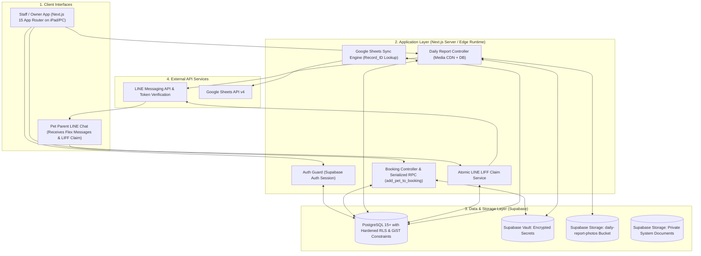

# 🏛️ PawSpace — System Architecture & Production-Ready Specification

> **Document Status:** Production-Ready Specification (Hardened & Audited)  
> **Target Release:** V1 Lean MVP  
> **Security & Data Integrity Guarantees:**
> * Multi-Tenant Isolation via Composite Foreign Keys & Non-Recursive Supabase RLS
> * Cross-Tenant Attack Prevention in RPC via Internal `current_staff_shop_id()` Enforcement
> * Serialization & Race-Condition Safe Room Capacity Locking (`add_pet_to_booking`)
> * Direct Client INSERT Blocker on `booking_pets` (Enforces RPC Exclusivity)
> * Atomic Single-Statement Claim Token Consumption (Anti-Replay / Double Claim)
> * Permanent LINE Flex Media Delivery Contract via Dedicated Public CDN Storage
> * Multi-Tenant Secret Isolation via Supabase Vault (`vault.create_secret`)
> * Resilient Google Sheets Sync by `Record_ID` Key Lookup (Protected Column A System Range)

---

## 1. ผังการทำงานของระบบ V1 (System Architecture Diagram)



---

## 2. โครงสร้างฐานข้อมูลระดับ Production (Supabase PostgreSQL Schema & Integrity)

```sql
-- 0. Extensions
CREATE EXTENSION IF NOT EXISTS btree_gist;
CREATE EXTENSION IF NOT EXISTS "uuid-ossp";

-- 1. Shops / Tenants
CREATE TABLE shops (
    id UUID PRIMARY KEY DEFAULT gen_random_uuid(),
    name VARCHAR(255) NOT NULL,
    slug VARCHAR(100) UNIQUE NOT NULL,
    phone VARCHAR(50),
    line_oa_id VARCHAR(100),
    google_sheet_id VARCHAR(255),
    subscription_status VARCHAR(50) DEFAULT 'trial', -- trial, active, past_due
    created_at TIMESTAMPTZ DEFAULT now(),
    UNIQUE (id)
);

-- 2. Staff Users (ผูก 1:1 กับ auth.users ของ Supabase)
CREATE TABLE staff_users (
    id UUID PRIMARY KEY REFERENCES auth.users(id) ON DELETE CASCADE,
    shop_id UUID NOT NULL REFERENCES shops(id) ON DELETE CASCADE,
    email VARCHAR(255) NOT NULL,
    name VARCHAR(255) NOT NULL,
    role VARCHAR(50) DEFAULT 'staff', -- owner, manager, staff
    created_at TIMESTAMPTZ DEFAULT now(),
    UNIQUE (shop_id, id)
);

-- 3. Pet Owners (Customers) & Verified LINE Claim Fields
CREATE TABLE pet_owners (
    id UUID PRIMARY KEY DEFAULT gen_random_uuid(),
    shop_id UUID NOT NULL REFERENCES shops(id) ON DELETE CASCADE,
    line_user_id VARCHAR(100), -- Set ONLY after server-side LINE token verification
    line_claim_token_hash VARCHAR(64), -- SHA-256 hash of one-time claim token
    line_claim_expires_at TIMESTAMPTZ,
    line_claim_used_at TIMESTAMPTZ,
    first_name VARCHAR(100) NOT NULL,
    last_name VARCHAR(100),
    phone VARCHAR(50) NOT NULL,
    emergency_phone VARCHAR(50),
    address TEXT,
    created_at TIMESTAMPTZ DEFAULT now(),
    UNIQUE (shop_id, id),
    UNIQUE (shop_id, phone)
);

-- 4. Pets
CREATE TABLE pets (
    id UUID PRIMARY KEY DEFAULT gen_random_uuid(),
    shop_id UUID NOT NULL REFERENCES shops(id) ON DELETE CASCADE,
    owner_id UUID NOT NULL,
    name VARCHAR(100) NOT NULL,
    species VARCHAR(50) NOT NULL, -- dog, cat
    breed VARCHAR(100),
    gender VARCHAR(20), -- male, female, neutered_male, spayed_female
    birth_date DATE,
    weight_kg NUMERIC(5,2),
    avatar_url TEXT,
    special_care_notes TEXT, -- อาหารเฉพาะ, ยาประจำตัว, พฤติกรรมที่ต้องระวัง
    allergies TEXT,
    created_at TIMESTAMPTZ DEFAULT now(),
    UNIQUE (shop_id, id),
    -- Composite FK: Enforce pet's owner belongs to the exact same shop
    FOREIGN KEY (shop_id, owner_id) REFERENCES pet_owners(shop_id, id) ON DELETE CASCADE
);

-- 5. Rooms & Spaces
CREATE TABLE rooms (
    id UUID PRIMARY KEY DEFAULT gen_random_uuid(),
    shop_id UUID NOT NULL REFERENCES shops(id) ON DELETE CASCADE,
    room_number VARCHAR(50) NOT NULL,
    room_type VARCHAR(50) NOT NULL, -- standard, deluxe, vip, cat_condo
    capacity_pets INT NOT NULL DEFAULT 1 CHECK (capacity_pets >= 1),
    base_price_per_night NUMERIC(10,2) NOT NULL CHECK (base_price_per_night >= 0),
    status VARCHAR(50) DEFAULT 'available', -- available, occupied, maintenance, cleaning
    created_at TIMESTAMPTZ DEFAULT now(),
    UNIQUE (shop_id, id),
    UNIQUE (shop_id, room_number)
);

-- 6. Bookings (With DB Exclusion Constraint for Collision Prevention)
CREATE TABLE bookings (
    id UUID PRIMARY KEY DEFAULT gen_random_uuid(),
    shop_id UUID NOT NULL REFERENCES shops(id) ON DELETE CASCADE,
    owner_id UUID NOT NULL,
    room_id UUID NOT NULL,
    check_in_date DATE NOT NULL,
    check_out_date DATE NOT NULL,
    booking_status VARCHAR(50) DEFAULT 'confirmed', -- confirmed, checked_in, checked_out, cancelled
    total_amount NUMERIC(10,2) NOT NULL DEFAULT 0,
    special_requests TEXT,
    created_at TIMESTAMPTZ DEFAULT now(),
    UNIQUE (shop_id, id),

    -- Composite FKs: Guarantee room & owner belong to the same shop
    FOREIGN KEY (shop_id, owner_id) REFERENCES pet_owners(shop_id, id) ON DELETE RESTRICT,
    FOREIGN KEY (shop_id, room_id) REFERENCES rooms(shop_id, id) ON DELETE RESTRICT,
    
    -- Date Range Validity
    CONSTRAINT check_dates_valid CHECK (check_out_date > check_in_date),
    
    -- PostgreSQL GiST Exclusion Constraint: Prevent Room Overlap at Database Engine
    CONSTRAINT prevent_double_booking EXCLUDE USING gist (
        room_id WITH =,
        daterange(check_in_date, check_out_date, '[)') WITH &&
    ) WHERE (booking_status IN ('confirmed', 'checked_in'))
);

-- 7. Booking Pets (Junction Table: Multi-Pet per Booking)
CREATE TABLE booking_pets (
    id UUID PRIMARY KEY DEFAULT gen_random_uuid(),
    shop_id UUID NOT NULL,
    booking_id UUID NOT NULL,
    pet_id UUID NOT NULL,
    created_at TIMESTAMPTZ DEFAULT now(),
    UNIQUE (booking_id, pet_id),
    -- Composite FKs: Enforce tenant integrity across junction
    FOREIGN KEY (shop_id, booking_id) REFERENCES bookings(shop_id, id) ON DELETE CASCADE,
    FOREIGN KEY (shop_id, pet_id) REFERENCES pets(shop_id, id) ON DELETE RESTRICT
);

-- 8. Daily Care Reports
CREATE TABLE daily_reports (
    id UUID PRIMARY KEY DEFAULT gen_random_uuid(),
    shop_id UUID NOT NULL REFERENCES shops(id) ON DELETE CASCADE,
    booking_id UUID NOT NULL,
    pet_id UUID NOT NULL,
    report_date DATE NOT NULL DEFAULT CURRENT_DATE,
    food_status VARCHAR(50) NOT NULL,      -- finished, half, little, refused
    excretion_status VARCHAR(50) NOT NULL, -- normal, diarrhea, none
    mood_status VARCHAR(50) NOT NULL,      -- happy, calm, stressed, playful
    photo_urls TEXT[] NOT NULL DEFAULT '{}',
    staff_notes TEXT,
    sent_to_line_at TIMESTAMPTZ,
    created_at TIMESTAMPTZ DEFAULT now(),
    
    -- Composite FK: Link to booking & pet
    FOREIGN KEY (shop_id, booking_id) REFERENCES bookings(shop_id, id) ON DELETE CASCADE,
    FOREIGN KEY (shop_id, pet_id) REFERENCES pets(shop_id, id) ON DELETE CASCADE,

    -- Constraint: Enforce 1 to 4 photos strictly using cardinality
    CONSTRAINT check_photo_count CHECK (cardinality(photo_urls) BETWEEN 1 AND 4)
);

-- 9. Sync Outbox & Mapping (Google Sheets Sync by Record_ID)
CREATE TABLE google_sync_mappings (
    id UUID PRIMARY KEY DEFAULT gen_random_uuid(),
    shop_id UUID NOT NULL REFERENCES shops(id) ON DELETE CASCADE,
    entity_type VARCHAR(50) NOT NULL, -- customer, booking
    entity_id UUID NOT NULL,
    sheet_name VARCHAR(100) NOT NULL,
    synced_hash TEXT,
    last_synced_at TIMESTAMPTZ DEFAULT now(),
    UNIQUE (shop_id, entity_type, entity_id)
);

CREATE TABLE sync_queue (
    id UUID PRIMARY KEY DEFAULT gen_random_uuid(),
    shop_id UUID NOT NULL REFERENCES shops(id) ON DELETE CASCADE,
    entity_type VARCHAR(50) NOT NULL,
    entity_id UUID NOT NULL,
    operation VARCHAR(20) NOT NULL, -- UPSERT, DELETE
    payload JSONB NOT NULL,
    attempts INT DEFAULT 0,
    status VARCHAR(50) DEFAULT 'pending', -- pending, processing, failed, completed
    last_error TEXT,
    created_at TIMESTAMPTZ DEFAULT now()
);
```

---

## 3. Hardened Security Definer Functions & Non-Recursive RLS

```sql
-- 1. Hardened Helper Function: Get Current Staff Shop ID
CREATE OR REPLACE FUNCTION current_staff_shop_id()
RETURNS UUID AS $$
    SELECT shop_id FROM staff_users WHERE id = auth.uid();
$$ LANGUAGE sql STABLE SECURITY DEFINER SET search_path = public, pg_temp;

REVOKE ALL ON FUNCTION current_staff_shop_id() FROM PUBLIC;
GRANT EXECUTE ON FUNCTION current_staff_shop_id() TO authenticated, service_role;

-- 2. Hardened Helper Function: Check Staff Role (Non-Recursive RLS Safe)
CREATE OR REPLACE FUNCTION is_shop_owner()
RETURNS BOOLEAN AS $$
    SELECT EXISTS (
        SELECT 1 FROM staff_users 
        WHERE id = auth.uid() AND role = 'owner'
    );
$$ LANGUAGE sql STABLE SECURITY DEFINER SET search_path = public, pg_temp;

REVOKE ALL ON FUNCTION is_shop_owner() FROM PUBLIC;
GRANT EXECUTE ON FUNCTION is_shop_owner() TO authenticated, service_role;
```

---

## 4. Concurrency-Safe RPCs & Triggers

### 1. Hardened Concurrency-Safe RPC: `add_pet_to_booking`
ฟังก์ชันนี้จะ **ไม่รับ `shop_id` จาก client** แต่จะดึงจาก `current_staff_shop_id()` ภายในฟังก์ชันโดยตรง เพื่อปิดช่องโหว่ Cross-Tenant Attack ได้อย่างเด็ดขาด:

```sql
CREATE OR REPLACE FUNCTION add_pet_to_booking(
    p_booking_id UUID,
    p_pet_id UUID
)
RETURNS VOID AS $$
DECLARE
    v_shop_id UUID;
    v_room_id UUID;
    v_capacity INT;
    v_current_count INT;
BEGIN
    -- 1. Identify caller shop strictly from session
    v_shop_id := current_staff_shop_id();
    IF v_shop_id IS NULL THEN
        RAISE EXCEPTION 'Unauthorized: Caller is not an authenticated staff member.';
    END IF;

    -- 2. Verify that pet belongs to the caller's shop
    IF NOT EXISTS (SELECT 1 FROM pets WHERE id = p_pet_id AND shop_id = v_shop_id) THEN
        RAISE EXCEPTION 'Unauthorized: Pet % does not belong to shop %.', p_pet_id, v_shop_id;
    END IF;

    -- 3. Row Lock the Booking in caller's shop to serialize concurrent additions
    SELECT room_id INTO v_room_id 
    FROM bookings 
    WHERE id = p_booking_id AND shop_id = v_shop_id 
    FOR UPDATE;

    IF NOT FOUND THEN
        RAISE EXCEPTION 'Booking % not found for shop %.', p_booking_id, v_shop_id;
    END IF;

    -- 4. Fetch room capacity
    SELECT capacity_pets INTO v_capacity 
    FROM rooms 
    WHERE id = v_room_id AND shop_id = v_shop_id;

    -- 5. Count current pets in this booking
    SELECT COUNT(*) INTO v_current_count 
    FROM booking_pets 
    WHERE booking_id = p_booking_id AND shop_id = v_shop_id;

    -- 6. Enforce capacity limit
    IF v_current_count >= v_capacity THEN
        RAISE EXCEPTION 'Cannot add pet: Room capacity of % exceeded for Booking %.', v_capacity, p_booking_id;
    END IF;

    -- 7. Insert junction record (Safe against bypass)
    INSERT INTO booking_pets (shop_id, booking_id, pet_id)
    VALUES (v_shop_id, p_booking_id, p_pet_id);
END;
$$ LANGUAGE plpgsql SECURITY DEFINER SET search_path = public, pg_temp;

REVOKE ALL ON FUNCTION add_pet_to_booking(UUID, UUID) FROM PUBLIC;
GRANT EXECUTE ON FUNCTION add_pet_to_booking(UUID, UUID) TO authenticated, service_role;
```

### 2. Atomic Single-Statement LIFF Claim RPC: `claim_pet_owner_line_account`
ป้องกัน Double-Claim หรือ Replay Attack จาก Concurrent Requests:

```sql
CREATE OR REPLACE FUNCTION claim_pet_owner_line_account(
    p_token_hash VARCHAR(64),
    p_verified_line_user_id VARCHAR(100)
)
RETURNS TABLE (owner_id UUID, shop_id UUID) AS $$
BEGIN
    -- Atomic consume in a single SQL statement
    RETURN QUERY
    UPDATE pet_owners
    SET line_user_id = p_verified_line_user_id,
        line_claim_used_at = now()
    WHERE line_claim_token_hash = p_token_hash
      AND line_claim_used_at IS NULL
      AND line_claim_expires_at > now()
    RETURNING id, pet_owners.shop_id;
END;
$$ LANGUAGE plpgsql SECURITY DEFINER SET search_path = public, pg_temp;

REVOKE ALL ON FUNCTION claim_pet_owner_line_account(VARCHAR, VARCHAR) FROM PUBLIC;
GRANT EXECUTE ON FUNCTION claim_pet_owner_line_account(VARCHAR, VARCHAR) TO service_role;
```

### 3. Trigger ตรวจสอบว่าสัตว์เลี้ยงที่ส่ง Daily Report อยู่ใน Booking นั้นจริง
```sql
CREATE OR REPLACE FUNCTION verify_pet_in_booking()
RETURNS TRIGGER AS $$
DECLARE
    v_exists BOOLEAN;
BEGIN
    SELECT EXISTS (
        SELECT 1 FROM booking_pets 
        WHERE booking_id = NEW.booking_id AND pet_id = NEW.pet_id AND shop_id = NEW.shop_id
    ) INTO v_exists;

    IF NOT v_exists THEN
        RAISE EXCEPTION 'Invalid Daily Report: Pet % is not registered in Booking %.', NEW.pet_id, NEW.booking_id;
    END IF;

    RETURN NEW;
END;
$$ LANGUAGE plpgsql SECURITY DEFINER SET search_path = public, pg_temp;

CREATE TRIGGER trg_verify_daily_report_pet
BEFORE INSERT OR UPDATE ON daily_reports
FOR EACH ROW EXECUTE FUNCTION verify_pet_in_booking();
```

---

## 5. นโยบายความปลอดภัยของฐานข้อมูล (Hardened Supabase RLS Policies)

```sql
-- 1. Enable RLS on all 10 tables
ALTER TABLE shops ENABLE ROW LEVEL SECURITY;
ALTER TABLE staff_users ENABLE ROW LEVEL SECURITY;
ALTER TABLE pet_owners ENABLE ROW LEVEL SECURITY;
ALTER TABLE pets ENABLE ROW LEVEL SECURITY;
ALTER TABLE rooms ENABLE ROW LEVEL SECURITY;
ALTER TABLE bookings ENABLE ROW LEVEL SECURITY;
ALTER TABLE booking_pets ENABLE ROW LEVEL SECURITY;
ALTER TABLE daily_reports ENABLE ROW LEVEL SECURITY;
ALTER TABLE google_sync_mappings ENABLE ROW LEVEL SECURITY;
ALTER TABLE sync_queue ENABLE ROW LEVEL SECURITY;

-- shops
CREATE POLICY "Staff can view their own shop"
    ON shops FOR SELECT
    USING (id = current_staff_shop_id());

CREATE POLICY "Shop owners can update their shop"
    ON shops FOR UPDATE
    USING (id = current_staff_shop_id() AND is_shop_owner());

-- staff_users (Non-Recursive RLS via is_shop_owner())
CREATE POLICY "Staff can view staff members of their shop"
    ON staff_users FOR SELECT
    USING (shop_id = current_staff_shop_id());

CREATE POLICY "Shop owners can manage staff members"
    ON staff_users FOR ALL
    USING (shop_id = current_staff_shop_id() AND is_shop_owner());

-- pet_owners
CREATE POLICY "Staff can manage pet owners of their shop"
    ON pet_owners FOR ALL
    USING (shop_id = current_staff_shop_id())
    WITH CHECK (shop_id = current_staff_shop_id());

-- pets
CREATE POLICY "Staff can manage pets of their shop"
    ON pets FOR ALL
    USING (shop_id = current_staff_shop_id())
    WITH CHECK (shop_id = current_staff_shop_id());

-- rooms
CREATE POLICY "Staff can manage rooms of their shop"
    ON rooms FOR ALL
    USING (shop_id = current_staff_shop_id())
    WITH CHECK (shop_id = current_staff_shop_id());

-- bookings
CREATE POLICY "Staff can manage bookings of their shop"
    ON bookings FOR ALL
    USING (shop_id = current_staff_shop_id())
    WITH CHECK (shop_id = current_staff_shop_id());

-- booking_pets (ALLOW SELECT & DELETE ONLY; DIRECT INSERT/UPDATE DENIED BY DEFAULT TO ENFORCE RPC)
CREATE POLICY "Staff can view booking_pets of their shop"
    ON booking_pets FOR SELECT
    USING (shop_id = current_staff_shop_id());

CREATE POLICY "Staff can delete booking_pets of their shop"
    ON booking_pets FOR DELETE
    USING (shop_id = current_staff_shop_id());

-- daily_reports
CREATE POLICY "Staff can manage daily reports of their shop"
    ON daily_reports FOR ALL
    USING (shop_id = current_staff_shop_id())
    WITH CHECK (shop_id = current_staff_shop_id());

-- google_sync_mappings
CREATE POLICY "Staff can manage sync mappings of their shop"
    ON google_sync_mappings FOR ALL
    USING (shop_id = current_staff_shop_id())
    WITH CHECK (shop_id = current_staff_shop_id());

-- sync_queue
CREATE POLICY "Staff can manage sync queue of their shop"
    ON sync_queue FOR ALL
    USING (shop_id = current_staff_shop_id())
    WITH CHECK (shop_id = current_staff_shop_id());
```

---

## 6. สัญญาการจัดส่งรูปภาพ (Media Delivery Contract for LINE Flex Messages)

LINE Flex Messages กำหนดให้รูปภาพที่แสดงในแชท (`hero.url`) ต้องเป็น **HTTPS URL สาธารณะที่สามารถเข้าถึงได้ถาวรโดยไม่หมดอายุ (No Short Expiry)**:

1. **Storage Bucket:** รูปถ่าย Daily Report ถูกจัดเก็บใน Supabase Storage Bucket ชื่อ `daily-report-photos` (Public-Read Bucket with Unpredictable Object Paths)
2. **Object Path Convention:** `{shop_id}/{booking_id}/{crypto_random_uuid_v4}.jpg`
   * การใช้ Cryptographically Secure UUID v4 ป้องกันการสุ่มเดารูปภาพ (Security through Unpredictability)
3. **Storage Object Policies:**
   * **SELECT:** Public Read (เพื่อให้เซิร์ฟเวอร์ของ LINE Platform และแอป LINE ของลูกค้าดึงภาพไปแสดงผลได้ถาวร แม้เวลาผ่านไปหลายเดือน)
   * **INSERT / DELETE:** อนุญาตเฉพาะ Authenticated Staff ของ Shop นั้นๆ:
     ```sql
     CREATE POLICY "Staff can upload daily report photos"
     ON storage.objects FOR INSERT TO authenticated
     WITH CHECK (
         bucket_id = 'daily-report-photos' 
         AND (storage.foldername(name))[1] = current_staff_shop_id()::text
     );

     CREATE POLICY "Staff can delete daily report photos"
     ON storage.objects FOR DELETE TO authenticated
     USING (
         bucket_id = 'daily-report-photos' 
         AND (storage.foldername(name))[1] = current_staff_shop_id()::text
     );
     ```

---

## 7. การจัดเก็บ Token ลับผ่าน Supabase Vault

ความลับของแต่ละร้าน (เช่น LINE Channel Access Token, Google Refresh Token) ถูกจัดเก็บแบบ Encrypted ผ่าน Supabase Vault:

* **Signature มาตรฐานของ Vault:**
  ```sql
  -- vault.create_secret(secret_value, unique_name, description)
  SELECT vault.create_secret(
      p_secret_value,
      'line_token_shop_' || p_shop_id::text,
      'LINE Channel Access Token for shop ' || p_shop_id::text
  );
  ```
* **Security Rule:** ไม่อนุญาตให้ client-side เรียกอ่าน secret จาก vault โดยตรง การดึง token ทำผ่าน Trusted Server-Side Environment (Vercel Edge/Serverless) เท่านั้น

---

## 8. สถาปัตยกรรม Google Sheets Sync (Protected Record_ID Key Lookup)

1. **โครงสร้าง Sheet:**
   * **Column A:** `Record_ID` (System-managed UUID)
   * **Column B–G:** ข้อมูลลูกค้า หรือ ข้อมูลการจอง
2. **Data Integrity Rules:**
   * ร้านค้าสามารถ Sort, Filter, Reorder แถวได้อิสระ
   * มีการตั้งค่า **Protected Range** บน Column A เพื่อป้องกันการลบหรือแก้ไข Record_ID โดยไม่ตั้งใจ
   * **Sync Lookup:** ค้นหาพิกัดแถวจาก `Record_ID` ก่อนทำการ Update ทับ `A{row}:G{row}`
   * **Collision / Error Handling:**
     * หากพบ `Record_ID` ซ้ำกันใน Sheet ➔ Sync Job จะหยุดทำงานทันที (Fail & Raise Alert) เพื่อป้องกันการเขียนทับผิดคน
     * หากไม่พบ `Record_ID` ➔ ทำการตรวจสอบความถูกต้องก่อน Append แถวใหม่

---

## 9. ชุดทดสอบความปลอดภัยเชิงลบ (Negative Security Test Suite)

ก่อนนำระบบขึ้น Production ต้องผ่านการทดสอบ 6 กรณีนี้:

| กรณีทดสอบ (Test Case) | การกระทำ (Action) | ผลลัพธ์ที่คาดหวัง (Expected Result) |
| :--- | :--- | :--- |
| **1. Cross-Tenant RPC Execution** | Staff จาก Shop A เรียก `add_pet_to_booking(booking_b_id, pet_b_id)` | ❌ **Error:** Unauthorized (ไม่สามารถเข้าถึง Booking ของ Shop B ได้) |
| **2. Direct RLS Bypass on Junction** | Client ยิง `INSERT INTO booking_pets` ตรงผ่าน SDK | ❌ **Error 42501:** RLS Violation (บังคับให้เรียกผ่าน RPC เท่านั้น) |
| **3. Non-Recursive Staff Query** | Query `SELECT * FROM staff_users` ในฐานะ Owner | ✅ **Success:** ดึงข้อมูลได้ถูกต้อง ไม่ติด Infinite Recursion Loop |
| **4. Concurrency Double Claim** | ยิง Request เคลม LINE Token เดียวกันพร้อมกัน 2 สาย | ✅ **Success:** 1 Request ได้สิทธิ์, อีก 1 Request คืนค่า 0 แถว (Claim Fail) |
| **5. Room Capacity Race Condition** | เรียก `add_pet_to_booking` พร้อมกัน 2 สายในห้องที่เหลือ 1 ที่ | ✅ **Success:** 1 Pet เข้าห้องสำเร็จ, อีก 1 Pet ติด Exception ความจุห้องเต็ม |
| **6. Permanent Media Delivery** | เรียกดูภาพใน LINE Flex Message ย้อนหลัง 30 วัน | ✅ **Success:** รูปภาพยังคงแสดงผลได้สมบูรณ์ ไม่หมดอายุ |
